# DO180 — Red Hat OpenShift I: Contenedores y Kubernetes

**Documentación del curso**

Este documento recoge de forma ordenada los contenidos del curso: lo explicado
en clase (carpeta `notas/`) y los manifiestos de ejemplo (carpeta `ejemplos/`).
Incluye además el bloque de **almacenamiento y volúmenes**, tanto en Docker como
en Kubernetes.

Las instrucciones para conectarse al clúster del curso están en un documento
aparte: [acceso-al-cluster.md](acceso-al-cluster.md).

---

## Índice

1. [Formas de desplegar software](#1-formas-de-desplegar-software)
2. [Contenedores](#2-contenedores)
3. [Imágenes de contenedor](#3-imágenes-de-contenedor)
4. [Redes en contenedores](#4-redes-en-contenedores)
5. [Volúmenes en contenedores](#5-volúmenes-en-contenedores)
6. [DevOps y automatización](#6-devops-y-automatización)
7. [Entornos de producción](#7-entornos-de-producción)
8. [Kubernetes: qué es y cómo se trabaja con él](#8-kubernetes-qué-es-y-cómo-se-trabaja-con-él)
9. [Arquitectura de un clúster de Kubernetes](#9-arquitectura-de-un-clúster-de-kubernetes)
10. [YAML](#10-yaml)
11. [Recursos de Kubernetes](#11-recursos-de-kubernetes)
12. [Comunicaciones en el clúster](#12-comunicaciones-en-el-clúster)
13. [Almacenamiento en Kubernetes](#13-almacenamiento-en-kubernetes)
14. [Operación del clúster: probes](#14-operación-del-clúster-probes)
15. [El cliente `kubectl`](#15-el-cliente-kubectl)
16. [Anexo A: conceptos de apoyo](#anexo-a-conceptos-de-apoyo)
17. [Anexo B: manifiestos de ejemplo](#anexo-b-manifiestos-de-ejemplo)

---

## 1. Formas de desplegar software

A lo largo del tiempo se han usado tres modelos para poner software en
funcionamiento.

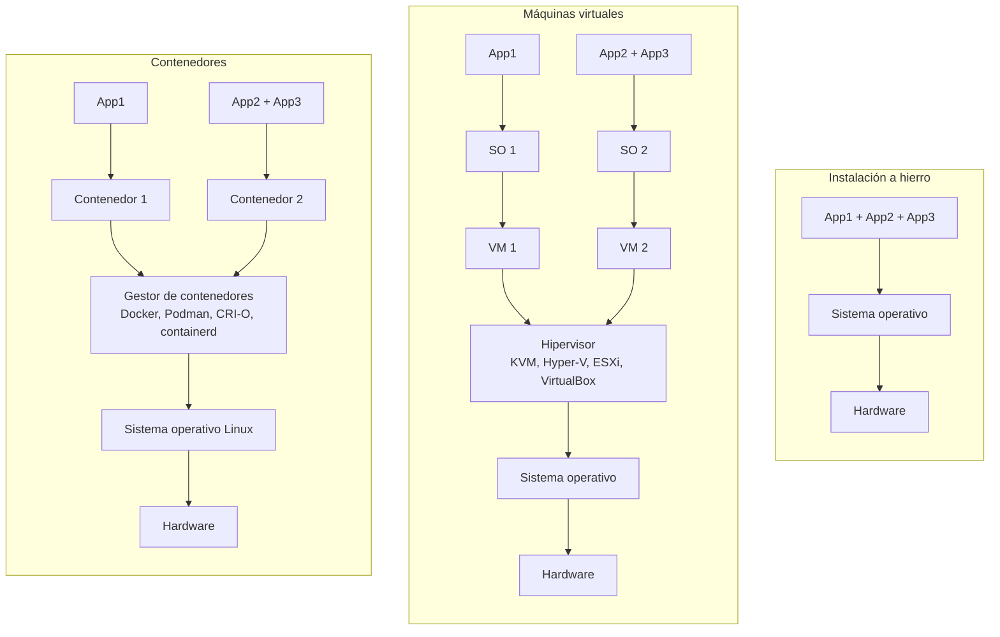
```mermaid
flowchart TB
    subgraph H["Instalación a hierro"]
        direction TB
        h1["App1 + App2 + App3"] --> h2["Sistema operativo"] --> h3["Hardware"]
    end
    subgraph V["Máquinas virtuales"]
        direction TB
        v1["App1"] --> v3["SO 1"] --> v5["VM 1"]
        v2["App2 + App3"] --> v4["SO 2"] --> v6["VM 2"]
        v5 --> v7["Hipervisor<br/>KVM, Hyper-V, ESXi, VirtualBox"]
        v6 --> v7
        v7 --> v8["Sistema operativo"] --> v9["Hardware"]
    end
    subgraph C["Contenedores"]
        direction TB
        c1["App1"] --> c3["Contenedor 1"]
        c2["App2 + App3"] --> c4["Contenedor 2"]
        c3 --> c5["Gestor de contenedores<br/>Docker, Podman, CRI-O, containerd"]
        c4 --> c5
        c5 --> c6["Sistema operativo Linux"] --> c7["Hardware"]
    end
```

### 1.1 Instalación a hierro

Todas las aplicaciones se instalan directamente sobre el sistema operativo de
la máquina. Presenta problemas graves en producción:

- **Dependencia del hardware.**
- **Falta de aislamiento entre aplicaciones:**
  - incompatibilidades entre dependencias o entre configuraciones del sistema
    operativo;
  - una aplicación puede acceder a los datos de otra;
  - un fallo en una aplicación (por ejemplo, un consumo de CPU del 100 %)
    deja sin servicio a todas las demás.

### 1.2 Máquinas virtuales

Cada aplicación se ejecuta en un entorno aislado con su propio sistema
operativo, sobre un hipervisor. Resuelven los problemas anteriores, pero
introducen otros:

- configuración y mantenimiento más complejos;
- merma de recursos (cada VM arrastra un sistema operativo completo);
- peor rendimiento de las aplicaciones;
- coste de licencias.

### 1.3 Contenedores

El modelo se formaliza en 2013 con Docker Inc., aunque las ideas en las que se
basa son muy anteriores. Un contenedor **no es una máquina virtual** ni se le
parece técnicamente, pero cumple la misma función: proporcionar un **entorno
aislado** en el que ejecutar aplicaciones.

Ventajas frente a las máquinas virtuales:

| Aspecto            | Máquina virtual                         | Contenedor                                   |
|--------------------|-----------------------------------------|----------------------------------------------|
| Sistema operativo  | Uno completo por VM                     | Comparte el kernel del anfitrión             |
| Tamaño             | Gigabytes                               | Megabytes                                    |
| Merma de recursos  | Significativa                           | Prácticamente nula                           |
| Rendimiento        | Penalizado por la virtualización        | Equivalente a la instalación a hierro        |
| Arranque           | Minutos                                 | Segundos                                     |

En resumen: las ventajas de la instalación a hierro sin los inconvenientes de
las máquinas virtuales. Hoy la mayor parte de lo que antes se desplegaba en VMs
se despliega en contenedores, y los grandes fabricantes de virtualización
(Red Hat con OpenShift, VMware con Tanzu, Nutanix con Karbon) han orientado sus
productos hacia ellos.

---

## 2. Contenedores

### 2.1 Definición

> Un **contenedor** es un entorno aislado, dentro de un sistema operativo con
> kernel Linux, en el que se ejecutan procesos.

El aislamiento abarca:

- **Red:** cada contenedor tiene su propia configuración de red y su propia IP.
- **Sistema de archivos:** propio, aislado del resto de contenedores y del
  anfitrión.
- **Variables de entorno:** propias.
- **Recursos:** se puede limitar su consumo de CPU, memoria y almacenamiento.

Todos los procesos de todos los contenedores de una máquina **comparten el
kernel** del sistema operativo anfitrión. En Linux, un contenedor es en
definitiva un proceso que crea un entorno aislado para ejecutar otros procesos:
un `ps -eaf` en el anfitrión muestra los procesos de los contenedores.

Dos consecuencias prácticas:

- **No se instala software: se despliega.** Los contenedores se crean a partir
  de **imágenes de contenedor**, que ya traen el software instalado y
  configurado.
- **Los contenedores no se actualizan: se sustituyen.** Para pasar de MySQL
  5.7.2 a 5.7.3 no se entra al contenedor a actualizarlo; se **borra** y se
  **crea uno nuevo** desde la imagen de la versión nueva. Kubernetes borra y
  recrea contenedores continuamente; no existe «mover» un contenedor de una
  máquina a otra, sino borrarlo en una y crear otro en la otra. (Esto es lo que
  obliga a sacar los datos fuera del contenedor: ver
  [sección 5](#5-volúmenes-en-contenedores).)

### 2.2 Contenedores en distintos sistemas operativos

Los contenedores requieren un kernel Linux.

| Sistema   | ¿Kernel Linux?                       | Cómo ejecuta contenedores                                      |
|-----------|--------------------------------------|----------------------------------------------------------------|
| GNU/Linux | Sí                                   | Directamente                                                   |
| Windows   | Mediante WSL (Subsistema de Windows para Linux) | WSL proporciona un kernel Linux; se habilita como característica de Windows |
| macOS     | No (kernel XNU)                      | Docker Desktop crea una máquina virtual Linux donde corren los contenedores |

### 2.3 Gestores de contenedores

Son los programas que descargan imágenes y crean, arrancan, paran y borran
contenedores: **Docker**, **Podman** (la apuesta de Red Hat), LXC, y los
orientados a Kubernetes, **CRI-O** y **containerd**.

Las operaciones quedan estandarizadas, sea cual sea el programa que corra
dentro:

| Operación                     | Comando                                         |
|-------------------------------|-------------------------------------------------|
| Instalar Jenkins              | `docker container create --name mi-jenkins jenkins` |
| Arrancar nginx                | `docker container start mi-nginx`               |
| Parar Jenkins                 | `docker container stop mi-jenkins`              |
| Reiniciar Kafka               | `docker container restart mi-kafka`             |
| Ver los logs de Apache httpd  | `docker logs mi-apache-httpd`                   |

Esta estandarización es lo que hace posible que un programa —Kubernetes— opere
cualquier software de forma automática.

---

## 3. Imágenes de contenedor

### 3.1 Contenido de una imagen

Una imagen es un archivo comprimido (tar) que contiene:

- una **estructura de carpetas**, habitualmente según el estándar POSIX
  (`/etc` configuración, `/var` datos y logs, `/bin` binarios, `/opt`
  aplicaciones, `/home`, `/root`, `/lib`, `/usr`…);
- **programas preinstalados**: el programa principal de la imagen y muchos
  otros de apoyo;
- **configuraciones por defecto** listas para usar;
- **metadatos**:
  - carpetas donde el programa principal guarda sus datos (volúmenes);
  - puertos que usa;
  - variables de entorno que admite y sus valores por defecto;
  - comando que se ejecuta al arrancar el contenedor.

### 3.2 Imágenes base

Los fabricantes construyen sus imágenes partiendo de una **imagen base**
(Ubuntu, Debian, Fedora, UBI de Red Hat, Alpine…), que aporta la estructura
POSIX, los comandos básicos (`ls`, `cp`, `cat`, `sh`…) y las utilidades propias
de esa distribución:

| Imagen base | Gestor de paquetes | Shell |
|-------------|--------------------|-------|
| Ubuntu      | `apt`, `apt-get`   | bash  |
| Fedora      | `dnf`, `yum`       | bash  |
| Alpine      | `apk`              | sh    |

Sobre ella se añaden programas, configuración y ficheros, y se reempaqueta.

### 3.3 Registros y referencia de una imagen

Las imágenes se descargan de **registros** de repositorios de imágenes. Hoy
prácticamente todo el software empresarial se distribuye así.

| Registro                      | Dirección                         |
|-------------------------------|-----------------------------------|
| Docker Hub                    | `docker.io`                       |
| Quay (Red Hat)                | `quay.io`                         |
| Microsoft Artifact Registry   | `mcr.microsoft.com`               |
| Google Container Registry     | `gcr.io`                          |
| Oracle Container Registry     | `container-registry.oracle.com`   |

La descarga la hace el gestor de contenedores (`docker image pull`,
`podman pull`) a partir de una referencia con esta forma:

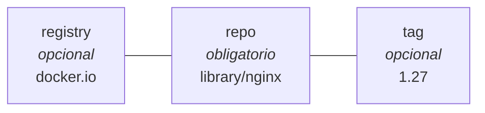
```mermaid
flowchart LR
    R["registry<br/><i>opcional</i><br/>docker.io"] --- P["repo<br/><i>obligatorio</i><br/>library/nginx"] --- T["tag<br/><i>opcional</i><br/>1.27"]
```

- Sin **registry**, se usa el configurado por defecto en el gestor.
- Sin **tag**, se usa `latest`.

`docker image pull nginx` equivale a `docker image pull docker.io/library/nginx:latest`.

### 3.4 Tags

El tag identifica una imagen concreta dentro de un repositorio. Suele indicar:

- la **versión** del software (completa o parcial: `2`, `2.4`, `2.4.42`);
- un **canal** (`stable`, `beta`, `nightly`);
- **componentes adicionales** (`tomcat:9.0-jdk21`);
- a veces, la **imagen base** de la que parte.

Los tags pueden ser:

- **Fijos** (`2.4.42`): siempre apuntan a la misma imagen.
- **Flotantes** (`2.4`, `2`, `latest`): cambian de imagen con el tiempo.

| Tag             | Valoración                                                                 |
|-----------------|----------------------------------------------------------------------------|
| `httpd:latest`  | **Mala práctica.** No se sabe qué versión es; puede saltar a otra major y romper el sistema. Muchos fabricantes ni lo publican. |
| `httpd:2`       | Puede traer funcionalidades nuevas (minor) que no se usan y que pueden introducir errores. |
| `httpd:2.4`     | **Recomendado en producción.** Fija la funcionalidad (minor) y recibe correcciones (patch). |
| `httpd:2.4.42`  | Opción ultraconservadora: no recibe ni siquiera correcciones.              |

Esta recomendación se apoya en el versionado semántico, descrito en el
[Anexo A](#a1-versionado-semántico).

---

## 4. Redes en contenedores

### 4.1 Red virtual del gestor de contenedores

Además de la interfaz física (`eth`, p. ej. `192.168.0.200`) y de la interfaz
de *loopback* (`127.0.0.0/8`), el gestor de contenedores crea una **red virtual
privada**. En Docker, por defecto es `172.17.0.0/16`: el anfitrión toma la
`172.17.0.1` (y actúa como puerta de enlace) y los contenedores reciben
direcciones a partir de la `172.17.0.2`.

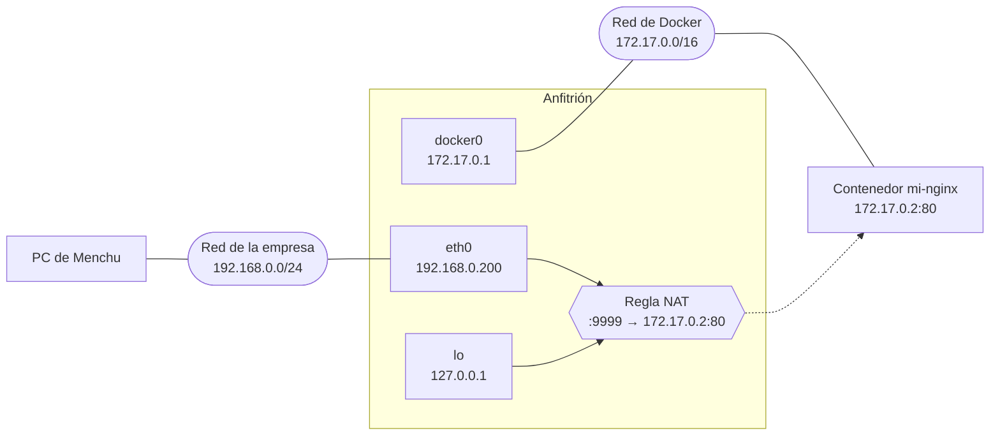
```mermaid
flowchart LR
    M["PC de Menchu"] --- LAN(["Red de la empresa<br/>192.168.0.0/24"])
    LAN --- HE["eth0<br/>192.168.0.200"]
    subgraph HOST["Anfitrión"]
        HE
        HL["lo<br/>127.0.0.1"]
        HD["docker0<br/>172.17.0.1"]
        NAT{{"Regla NAT<br/>:9999 → 172.17.0.2:80"}}
        HE --> NAT
        HL --> NAT
    end
    HD --- DN(["Red de Docker<br/>172.17.0.0/16"])
    DN --- C["Contenedor mi-nginx<br/>172.17.0.2:80"]
    NAT -.-> C
```

- Desde el anfitrión se llega al contenedor por su IP: `http://172.17.0.2:80`.
  El nombre `mi-nginx` **no** resuelve, porque el anfitrión usa el DNS de la
  empresa, que no lo conoce.
- Desde otro equipo de la red **no** se llega a `172.17.0.2`: no está conectado
  a la red virtual del anfitrión.

### 4.2 Exposición de puertos (NAT / *port forwarding*)

El anfitrión es el nexo entre ambas redes. Se crea en él una regla NAT que
reenvía las peticiones que llegan a un puerto suyo hacia el puerto del
contenedor. Docker la crea con la opción `-p`:

```bash
docker container create --name mi-nginx -p 192.168.0.200:9999:80 nginx
#                                          └─ IP anfitrión ┘ │    └ puerto contenedor
#                                                           puerto anfitrión
```

| Opción `-p`             | Quién puede acceder                                                         |
|-------------------------|-----------------------------------------------------------------------------|
| `9999:80` (= `0.0.0.0:9999:80`, valor por defecto) | Todo el que llegue a cualquier IP del anfitrión: `192.168.0.200:9999`, `localhost:9999`, `172.17.0.1:9999` |
| `127.0.0.1:9999:80`     | Solo el propio anfitrión, por `localhost:9999`. Útil para tener una dirección estable sin buscar la IP del contenedor, que puede cambiar entre arranques. |

Docker no es una herramienta pensada para producción. Para dar servicio a otros
en producción se usa Kubernetes ([sección 12](#12-comunicaciones-en-el-clúster)).

---

## 5. Volúmenes en contenedores

### 5.1 El problema: los contenedores son efímeros

El sistema de archivos de un contenedor es una **capa de escritura** que se
crea sobre la imagen y que **desaparece al borrar el contenedor**.

Como los contenedores no se actualizan sino que se sustituyen
([2.1](#21-definición)), cualquier dato escrito dentro del contenedor —la base
de datos de un MariaDB, los ficheros subidos a un WordPress— se perdería en la
primera actualización.

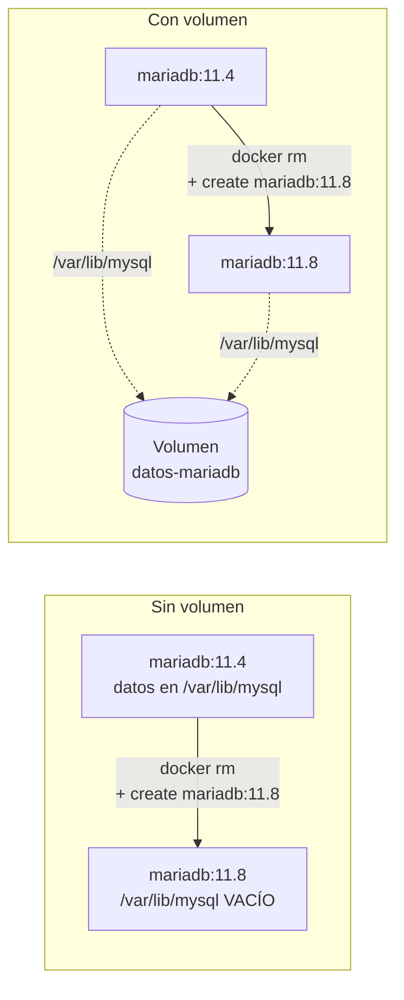
```mermaid
flowchart LR
    subgraph SIN["Sin volumen"]
        direction TB
        A1["mariadb:11.4<br/>datos en /var/lib/mysql"] -- "docker rm<br/>+ create mariadb:11.8" --> A2["mariadb:11.8<br/>/var/lib/mysql VACÍO"]
    end
    subgraph CON["Con volumen"]
        direction TB
        B1["mariadb:11.4"] -- "docker rm<br/>+ create mariadb:11.8" --> B2["mariadb:11.8"]
        V[("Volumen<br/>datos-mariadb")]
        B1 -. "/var/lib/mysql" .-> V
        B2 -. "/var/lib/mysql" .-> V
    end
```

> Un **volumen** es un almacenamiento externo al contenedor que se **monta**
> en una carpeta de su sistema de archivos. Su ciclo de vida es independiente
> del contenedor: sobrevive a su borrado.

Usos de los volúmenes:

1. **Persistir datos** más allá de la vida del contenedor.
2. **Compartir datos** entre contenedores.
3. **Inyectar ficheros** en el contenedor (configuración, certificados,
   código en desarrollo).
4. **Acceder a los datos desde el anfitrión** (copias de seguridad, consulta).

Las carpetas que conviene montar como volumen las documenta el fabricante de la
imagen, y suelen ir en sus metadatos (`VOLUME` en el Dockerfile; se ve con
`docker image inspect`).

### 5.2 Tipos de montaje

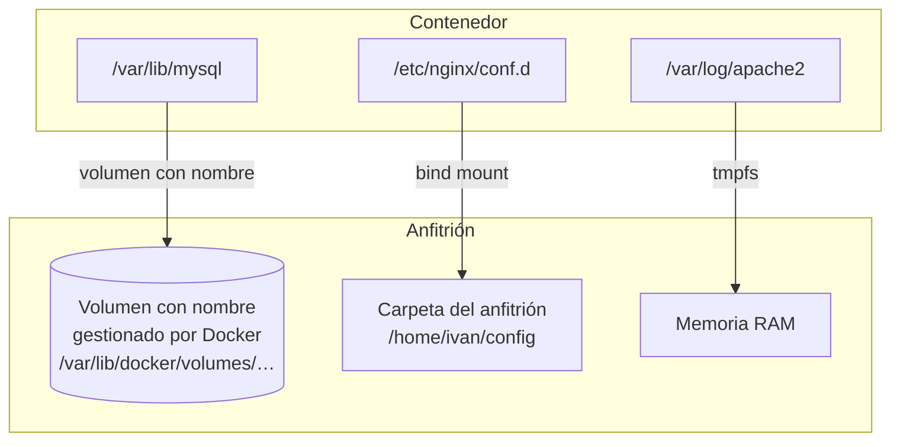
```mermaid
flowchart TB
    subgraph C["Contenedor"]
        D1["/var/lib/mysql"]
        D2["/etc/nginx/conf.d"]
        D3["/var/log/apache2"]
    end
    subgraph H["Anfitrión"]
        NV[("Volumen con nombre<br/>gestionado por Docker<br/>/var/lib/docker/volumes/…")]
        BM["Carpeta del anfitrión<br/>/home/ivan/config"]
        RAM["Memoria RAM"]
    end
    D1 -- "volumen con nombre" --> NV
    D2 -- "bind mount" --> BM
    D3 -- "tmpfs" --> RAM
```

| Tipo                  | Dónde están los datos                          | Sobrevive al contenedor | Uso típico                                                   |
|-----------------------|------------------------------------------------|-------------------------|--------------------------------------------------------------|
| **Volumen con nombre**| Zona gestionada por el gestor de contenedores  | Sí                      | Datos de aplicación: bases de datos, ficheros subidos        |
| **Bind mount**        | Una carpeta concreta del anfitrión que elijo   | Sí                      | Inyectar configuración; código fuente en desarrollo          |
| **tmpfs**             | Memoria RAM del anfitrión                      | No                      | Datos temporales o de alto volumen que no deben tocar disco (logs rotados, cachés) |

### 5.3 Volúmenes con nombre

Los gestiona Docker y se operan con comandos propios, como cualquier otro
objeto:

```bash
docker volume create datos-mariadb      # crear
docker volume ls                        # listar
docker volume inspect datos-mariadb     # ver detalle (incluye la ruta en el anfitrión)
docker volume rm datos-mariadb          # borrar (solo si ningún contenedor lo usa)
docker volume prune                     # borrar los que no usa ningún contenedor
```

Se montan al crear el contenedor con `-v nombre:ruta-en-contenedor`. Si el
volumen no existe, Docker lo crea:

```bash
docker container create --name mi-mariadb \
    -e MARIADB_ROOT_PASSWORD=password \
    -v datos-mariadb:/var/lib/mysql \
    -p 127.0.0.1:3306:3306 \
    mariadb:11.4
```

Actualizar la versión conservando los datos es, ahora sí, borrar y recrear:

```bash
docker container rm -f mi-mariadb
docker container create --name mi-mariadb \
    -e MARIADB_ROOT_PASSWORD=password \
    -v datos-mariadb:/var/lib/mysql \
    -p 127.0.0.1:3306:3306 \
    mariadb:11.8
docker container start mi-mariadb
```

> **Atención:** `docker container rm -v` borra también los volúmenes
> **anónimos** del contenedor (los que Docker crea sin nombre a partir de los
> metadatos de la imagen). Por eso conviene dar siempre nombre a los volúmenes
> que contienen datos.

### 5.4 Bind mounts

Montan una carpeta (o un fichero) del anfitrión, indicando su **ruta
absoluta**:

```bash
docker container create --name mi-nginx \
    -v /home/ivan/web:/usr/share/nginx/html:ro \
    -p 8080:80 \
    nginx:1.27
```

- El sufijo `:ro` monta en **solo lectura**: el contenedor no puede modificar
  los ficheros.
- Lo que hay en la carpeta del anfitrión **oculta** lo que la imagen tuviera en
  esa ruta.
- Ata el contenedor a una carpeta concreta de una máquina concreta: útil en
  desarrollo, poco portable en producción.

La sintaxis larga `--mount` es equivalente y más explícita:

```bash
--mount type=bind,source=/home/ivan/web,target=/usr/share/nginx/html,readonly
--mount type=volume,source=datos-mariadb,target=/var/lib/mysql
--mount type=tmpfs,target=/var/log/apache2,tmpfs-size=200m
```

### 5.5 tmpfs

Monta una carpeta **en memoria RAM**. No persiste ni se comparte, pero es muy
rápida y no consume disco:

```bash
docker container create --name mi-apache \
    --tmpfs /var/log/apache2:size=200m \
    httpd:2.4
```

Es el caso de los logs de Apache del ejemplo de WordPress
([11.3.3](#1133-contenedor-sidecar)): unos pocos ficheros rotados que otro
programa lee y envía a un sistema central, sin tocar el disco del servidor.

### 5.6 Podman y SELinux

En sistemas Red Hat (RHEL, Fedora) con SELinux activo, un contenedor no puede
leer una carpeta del anfitrión salvo que tenga la etiqueta adecuada. Podman la
aplica con un sufijo en el montaje:

```bash
podman run -d --name mi-nginx -v /home/ivan/web:/usr/share/nginx/html:Z nginx:1.27
```

| Sufijo | Efecto                                                                 |
|--------|------------------------------------------------------------------------|
| `:z`   | Etiqueta la carpeta para que la puedan usar **varios** contenedores    |
| `:Z`   | Etiqueta la carpeta para uso **exclusivo** de este contenedor          |

Por lo demás, los comandos de volúmenes de Podman son los mismos que los de
Docker (`podman volume create`, `podman volume ls`…).

### 5.7 Límites de los volúmenes en Docker

Un volumen de Docker vive en el disco de **una** máquina. Si esa máquina cae,
el contenedor puede recrearse en otra, pero sus datos no están allí. En
producción los datos no se guardan en los discos de los servidores —que son
para el sistema operativo y los programas— sino en **cabinas de
almacenamiento** accesibles por red. Esto es lo que resuelve Kubernetes
([sección 13](#13-almacenamiento-en-kubernetes)).

---

## 6. DevOps y automatización

### 6.1 Tareas y procesos

> **Automatizar** es construir una máquina, o cambiar su comportamiento
> mediante un programa, para que haga el trabajo que antes hacía una persona.

Es importante distinguir entre automatizar una **tarea** y automatizar un
**proceso**:

| Ejemplo                           | Lavadora                                | Persiana                                      |
|-----------------------------------|-----------------------------------------|-----------------------------------------------|
| Proceso manual                    | Lavar a mano                            | Subir y bajar con la cuerda                   |
| Tarea automatizada                | La lavadora lava; sigo separando ropa, cargando, eligiendo programa, tendiendo… | Un motor con botón; sigo decidiendo cuándo y pulsando |
| Proceso automatizado              | —                                       | Sensor de luz + controlador que acciona el motor |

**Solo tiene sentido automatizar un proceso cuando sus tareas ya están
automatizadas.**

### 6.2 DevOps

**DevOps** es una cultura, un movimiento, en pro de la automatización de todo
el trabajo entre el desarrollo (*Dev*) y la operación (*Ops*) del software.

Define grupos de tareas del ciclo de vida de una aplicación:

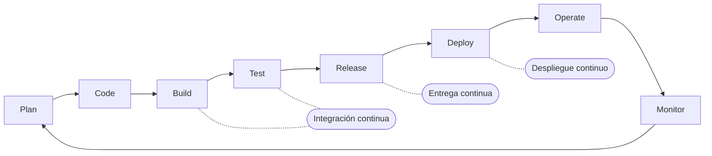
```mermaid
flowchart LR
    PL["Plan"] --> CO["Code"] --> BU["Build"] --> TE["Test"] --> RE["Release"] --> DE["Deploy"] --> OP["Operate"] --> MO["Monitor"] --> PL
    BU -.- CI(["Integración continua"])
    TE -.- CI
    RE -.- CDL(["Entrega continua"])
    DE -.- CDP(["Despliegue continuo"])
```

| Tarea     | Automatizable       | Herramientas (ejemplos)                                                       |
|-----------|---------------------|-------------------------------------------------------------------------------|
| Plan      | Poco                | —                                                                             |
| Code      | Cada vez más        | IA; en Java: Liquibase, Flyway, JPA, Springdoc                                |
| Build     | Totalmente          | Maven, Gradle, npm, webpack, dotnet                                           |
| Test      | Diseño: cada vez más. Ejecución: totalmente | JUnit, Mockito, Jest, Cypress, Selenium, SonarQube, Postman, JMeter |
| Release   | Totalmente          | Maven Central, npm, Docker Hub; internamente Nexus, Artifactory, GitLab Registry |
| Deploy    | En muchos casos     | Kubernetes, Ansible, Terraform                                                |
| Operate   | Sí                  | Kubernetes                                                                    |
| Monitor   | Sí                  | Prometheus, Elasticsearch/OpenSearch                                          |

Tres prácticas encadenadas:

- **Integración continua (CI):** tener continuamente en el entorno de
  integración la última versión del código, sometida a pruebas automatizadas.
  Su producto es un **informe de pruebas en tiempo real**.
- **Entrega continua:** además, poner automáticamente la nueva versión en manos
  del cliente (publicarla en un registro).
- **Despliegue continuo:** además, instalarla automáticamente en el entorno de
  producción.

Los procesos se automatizan mediante **pipelines** (scripts) ejecutados por
herramientas como Jenkins o GitLab CI/CD, que se disparan con un evento (un
`push` a Git) y encadenan compilación, pruebas, análisis de calidad, generación
de la imagen, publicación y despliegue **sin intervención humana**.

### 6.3 Los contenedores en el ciclo DevOps

- **En desarrollo:** una base de datos para pruebas locales se levanta en
  segundos, es igual para todo el equipo y se destruye al terminar, sin dejar
  restos en la máquina.
- **En compilación y pruebas:** se ejecutan dentro de contenedores efímeros,
  creados desde cero cada vez, con un entorno reproducible y aislado. Ya no se
  confía en un entorno de pruebas fijo que, tras decenas de instalaciones en un
  proyecto ágil, acaba «maleado».
- **En producción:** se despliega **la misma imagen** que se ha probado, con el
  mismo software y la misma instalación.

### 6.4 Infraestructura como código (IaC)

No basta con describir la infraestructura en ficheros de texto: hay que
**tratarla como código**, empezando por someterla a **control de versiones**.
La infraestructura evoluciona en versiones, y cada versión de la aplicación
depende de una versión concreta de la infraestructura:

| Versión del despliegue | 1.0.0           | 1.1.0                         | 1.1.1                    |
|------------------------|-----------------|-------------------------------|--------------------------|
| Apache                 | 2.24.7, 3 inst. | 2.25.0, 3–5 inst.             | 2.25.0, 3–5 inst.        |
| MySQL                  | 7.5.1, 1 inst.  | 8.0.0, 3 inst.                | 8.0.0, 3 inst.           |
| Balanceador para MySQL | No              | Sí                            | Sí                       |
| Volumen de Apache      | 10 GB           | 10 GB                         | 20 GB                    |

---

## 7. Entornos de producción

Lo que distingue un entorno de producción de los de desarrollo o pruebas son
dos características: **alta disponibilidad** y **escalabilidad**.

### 7.1 Alta disponibilidad

Tratar de garantizar que el sistema funcionará un porcentaje de tiempo pactado
contractualmente en un **SLA** (*Service Level Agreement*). Nunca puede
garantizarse el 100 %: el sistema corre sobre máquinas que se rompen. La
disponibilidad se mide en «nueves», y cada nueve adicional multiplica el
coste:

| Disponibilidad | Caída máxima al año | Qué exige                                                                 |
|----------------|---------------------|---------------------------------------------------------------------------|
| 90 %           | ≈ 36,5 días         | —                                                                         |
| 95 %           | ≈ 18,25 días        | —                                                                         |
| 99 %           | ≈ 3,65 días         | Poco más que una máquina                                                  |
| 99,9 %         | ≈ 8,76 horas        | Una máquina de respaldo ya instalada                                      |
| 99,99 %        | ≈ 52,56 minutos     | Monitorización avanzada; clúster activo-activo                           |
| 99,999 %       | ≈ 5,26 minutos      | Varios CPD alejados geográficamente, generadores, varios proveedores de red |

### 7.2 Escalabilidad

Capacidad de ajustar la infraestructura a las necesidades de cada momento.

- **Escalabilidad vertical:** más máquina (CPU, RAM, disco). Sirve para cargas
  que crecen de forma sostenida, hasta que la máquina no da más de sí.
- **Escalabilidad horizontal:** más máquinas, o menos. Es la que exigen las
  cargas de Internet, que varían bruscamente de un día —o de una hora— a otro
  (la web de pedidos de una pizzería durante un Madrid–Barça). Y debe estar
  **automatizada**: no solo añadir máquinas, sino instalar en ellas los
  programas, configurarlos, meterlos en clúster y en el balanceador.

**Esto es lo que resuelve Kubernetes.**

---

## 8. Kubernetes: qué es y cómo se trabaja con él

### 8.1 Definición

> **Kubernetes** es una herramienta para **definir**, mediante un lenguaje
> **declarativo**, entornos de producción basados en contenedores; y que se
> encarga de **crearlos, operarlos y monitorizarlos** automáticamente según esa
> definición.

Para Kubernetes los contenedores son casi una anécdota: **no los gestiona
directamente**. Le dice al gestor de contenedores de cada máquina (CRI-O,
containerd) qué contenedor arrancar, parar o reiniciar, y dónde. Su trabajo
real está en los conceptos de un entorno de producción:

| Concepto de producción           | Recurso de Kubernetes                   |
|----------------------------------|-----------------------------------------|
| Clúster activo-pasivo / activo-activo | Deployment, StatefulSet, DaemonSet |
| Balanceador de carga             | Service                                 |
| Proxy reverso                    | Ingress (Route en OpenShift)            |
| Reglas de firewall               | NetworkPolicy                           |
| Volúmenes en cabinas             | PersistentVolumeClaim, StorageClass     |
| Configuración de programas       | ConfigMap, Secret                       |
| Escalado automático              | HorizontalPodAutoscaler                 |

Un ejemplo de lo que literalmente se le pide a Kubernetes: «entre 3 y 10
Tomcat según el uso de CPU, cada uno con 4 cores y 16 GB, en máquinas físicas
distintas, compartiendo un volumen NFS de 1 TB; un balanceador delante y un
proxy reverso con HTTPS en `miapp.miempresa.com`; un PostgreSQL con un volumen
iSCSI de 2 TB, accesible solo desde los Tomcat; comprueba cada minuto que todos
responden y reinicia el que no lo haga». Kubernetes lo crea, lo opera 24×7 y,
si la definición cambia, adapta el entorno.

### 8.2 Lenguaje declarativo e idempotencia

| Imperativo                                                                 | Declarativo                                                     |
|----------------------------------------------------------------------------|-----------------------------------------------------------------|
| «Felipe, si hay algo que no sea una silla bajo la ventana, quítalo. Si no hay silla, ve a IKEA, compra una y ponla bajo la ventana.» | «Felipe, bajo la ventana tiene que haber una silla. Es tu responsabilidad.» |
| Describe **cómo** llegar al resultado                                      | Describe **el estado final deseado**                            |
| La idempotencia se consigue enumerando todos los estados iniciales posibles | La idempotencia es natural: el cómo se delega                   |

**Idempotencia:** propiedad de una operación que, sea cual sea el estado
inicial, deja siempre el sistema en el mismo estado final.

Las herramientas con más éxito hoy son declarativas: Docker Compose,
Kubernetes, Ansible, Terraform, Spring Boot, Angular. Varias de ellas usan
**YAML** ([sección 10](#10-yaml)).

En Kubernetes los documentos YAML son puramente declarativos —no contienen
verbos—; el verbo, imperativo, se da al cargarlos (`kubectl apply -f …`).

### 8.3 Dos perfiles, un lenguaje

Kubernetes ofrece un lenguaje común pensado para dos perfiles que trabajan en
paralelo sin interferirse:

- **Desarrollo** define la aplicación: qué versión de base de datos, en qué
  puerto, qué recursos necesita cada Tomcat, cuánto almacenamiento pide.
- **Administración de sistemas** decide si se le concede lo que pide, en qué
  cabina se crea el almacenamiento y cuáles son las contraseñas de producción.

### 8.4 Modelo de autoservicio

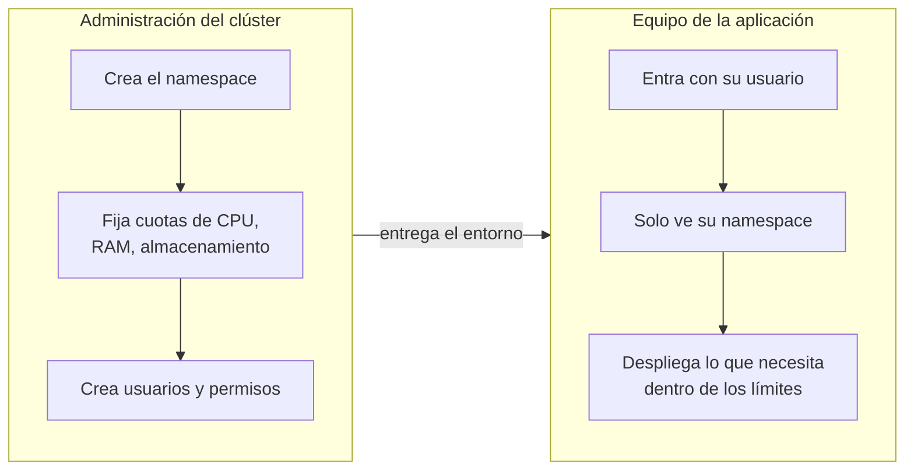
```mermaid
flowchart LR
    subgraph ADM["Administración del clúster"]
        direction TB
        A1["Crea el namespace"] --> A2["Fija cuotas de CPU,<br/>RAM, almacenamiento"] --> A3["Crea usuarios y permisos"]
    end
    subgraph EQ["Equipo de la aplicación"]
        direction TB
        E1["Entra con su usuario"] --> E2["Solo ve su namespace"] --> E3["Despliega lo que necesita<br/>dentro de los límites"]
    end
    ADM -- "entrega el entorno" --> EQ
```

Es el modelo **federado**, punto medio entre dos extremos que han fracasado:
el departamento de sistemas centralizado (burocracia, lentitud) y el modelo
externalizado en el que cada equipo se monta su infraestructura (falta de
estándares y de control). Un pequeño equipo de plataforma fija las políticas y
la infraestructura común; los equipos actúan con libertad dentro de ellas.

### 8.5 Kubernetes y OpenShift

Kubernetes es **extensible**: se le instalan *plugins*, llamados
**operadores**, que añaden nuevos tipos de recurso (CRD, *Custom Resource
Definitions*) y la lógica para gestionarlos.

**OpenShift** es la distribución de Kubernetes de Red Hat: un Kubernetes con un
conjunto de operadores preseleccionados. Kubernetes estándar ofrece unos 50
tipos de recurso; OpenShift, de fábrica, más de 500.

Objetivo del curso: aprender bien los recursos principales de Kubernetes y,
sobre todo, a **manejar cualquier tipo de recurso**, porque todos se operan del
mismo modo y sus particularidades están en la documentación.

---

## 9. Arquitectura de un clúster de Kubernetes

### 9.1 Nodos

Kubernetes gestiona un **clúster de máquinas** (nodos), normalmente físicas:

- **Plano de control** (*control plane*, antes «maestros»): al menos **3**
  nodos, para tener alta disponibilidad y quórum en `etcd`.
- **Nodos de trabajo** (*workers*): al menos **2**, donde corren las
  aplicaciones.
- Opcionalmente, **nodos de infraestructura**: nodos de trabajo reservados a
  programas de soporte (monitorización, gestores de certificados o de
  volúmenes…).

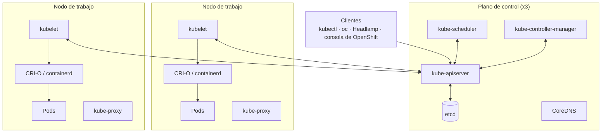
```mermaid
flowchart TB
    CLI["Clientes<br/>kubectl · oc · Headlamp · consola de OpenShift"] --> API
    subgraph CP["Plano de control (x3)"]
        API["kube-apiserver"]
        ETCD[("etcd")]
        SCH["kube-scheduler"]
        CM["kube-controller-manager"]
        DNS["CoreDNS"]
        API <--> ETCD
        SCH <--> API
        CM <--> API
    end
    subgraph W1["Nodo de trabajo"]
        K1["kubelet"] --> CR1["CRI-O / containerd"] --> P1["Pods"]
        KP1["kube-proxy"]
    end
    subgraph W2["Nodo de trabajo"]
        K2["kubelet"] --> CR2["CRI-O / containerd"] --> P2["Pods"]
        KP2["kube-proxy"]
    end
    K1 <--> API
    K2 <--> API
```

### 9.2 Componentes

| Componente               | Dónde corre                                  | Función                                                                 |
|--------------------------|----------------------------------------------|-------------------------------------------------------------------------|
| **kubelet**              | En cada nodo, instalado como servicio del SO | Agente de Kubernetes en el nodo: ordena al gestor de contenedores qué ejecutar |
| **kubeadm**              | En cada nodo, herramienta de línea de comandos | Instalación inicial, alta de nodos, mantenimiento                     |
| **kube-apiserver**       | Plano de control, en contenedor              | Puerta de entrada al clúster: recibe y valida **todas** las peticiones |
| **etcd**                 | Plano de control, en contenedor              | Base de datos interna: definiciones y estado del clúster                |
| **kube-scheduler**       | Plano de control, en contenedor              | Decide en qué nodo se ejecuta cada pod                                  |
| **kube-controller-manager** | Plano de control, en contenedor           | Ejecuta los controladores que llevan el estado real al deseado          |
| **CoreDNS**              | En contenedor                                | Servidor DNS interno del clúster                                        |
| **kube-proxy**           | En cada nodo, en contenedor                  | Traduce los Services a reglas de red del nodo ([12.3](#123-cómo-se-implementa-kube-proxy-y-netfilter)) |

Los componentes del plano de control se ejecutan como contenedores dentro del
propio clúster: **Kubernetes se instala en Kubernetes**.

### 9.3 Qué ocurre al aplicar un manifiesto

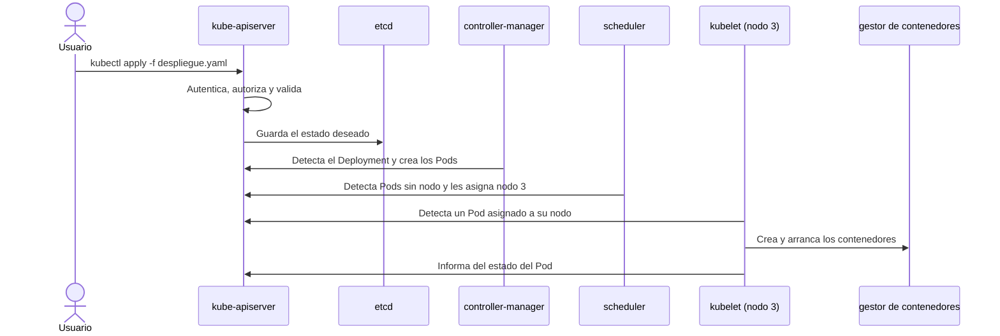
```mermaid
sequenceDiagram
    actor U as Usuario
    participant API as kube-apiserver
    participant E as etcd
    participant CM as controller-manager
    participant S as scheduler
    participant K as kubelet (nodo 3)
    participant CR as gestor de contenedores
    U->>API: kubectl apply -f despliegue.yaml
    API->>API: Autentica, autoriza y valida
    API->>E: Guarda el estado deseado
    CM->>API: Detecta el Deployment y crea los Pods
    S->>API: Detecta Pods sin nodo y les asigna nodo 3
    K->>API: Detecta un Pod asignado a su nodo
    K->>CR: Crea y arranca los contenedores
    K->>API: Informa del estado del Pod
```

Los componentes no se llaman unos a otros directamente: todos **observan** el
`kube-apiserver` y reaccionan a los cambios que les conciernen.

---

## 10. YAML

### 10.1 Qué es

**YAML** (*YAML Ain't Markup Language*) es un lenguaje para estructurar datos,
alternativo a JSON y XML, inspirado en Python y pensado para ser leído por
personas. Lo usan Kubernetes, Ansible, Docker Compose, GitLab CI/CD o Netplan.

Características:

- Admite **comentarios** con `#`.
- Un fichero puede contener **varios documentos**, separados por `---`
  (opcional antes del primero).
- La estructura se marca con el **sangrado**, que debe ser **consistente** en
  cada nivel. Un tabulador no equivale a espacios y produce un error de
  sintaxis: se necesita un editor adecuado (VS Code, Sublime Text, Cursor).
- Casi cualquier JSON es un YAML válido.

Cada documento es un **nodo**, que puede ser **escalar** o **colección**.

### 10.2 Escalares

```yaml
3            # entero
-1.98        # decimal
true         # booleano (también True, TRUE, false…)
Un texto sin comillas         # recomendado para textos de una línea
"Con \"escapes\" \n \t"       # comillas dobles: admiten la contrabarra
'Con ''comilla'' simple'      # comillas simples: la comilla se duplica
```

Recomendación: **no usar comillas** salvo que sean necesarias (el texto
contiene `#`, `:` u otros caracteres especiales, o debe tratarse como texto un
valor que parece número o booleano, como `"1"`).

Para textos de varias líneas hay dos sintaxis:

```yaml
literal: |
  Conserva los saltos de línea
  tal cual se escriben.
plegado: >
  Sustituye los saltos de línea
  por espacios.
```

### 10.3 Colecciones

**Listas** (ordenadas):

```yaml
- texto
- 33
- true
- - subelemento 1
  - subelemento 2
```

**Mapas** (clave–valor, **desordenados**: el orden de las claves no importa):

```yaml
nombre:     Iván
apellidos:
  - Osuna
  - Ayuste
direccion:
  calle:    Me la invento
  numero:   123
```

Existen sintaxis compactas heredadas de JSON (`[a, b]`, `{a: 1}`) que **se
desaconsejan**: son más difíciles de leer y, como Git compara por líneas,
ocultan qué valor concreto ha cambiado. Su único uso legítimo son la lista
vacía `[]` y el mapa vacío `{}`.

### 10.4 Esquemas

YAML solo fija la sintaxis. Cada programa define su **esquema**: qué claves son
válidas, qué tipos tienen y cuáles son obligatorias. El objetivo del curso es
aprender el esquema de Kubernetes.

> Referencia completa comentada: [plantilla.yaml](plantilla.yaml).

---

## 11. Recursos de Kubernetes

### 11.1 Estructura común de un manifiesto

Cada cosa que se quiere en el entorno de producción es un **recurso**, y cada
recurso se describe en un documento YAML:

```yaml
kind:         Deployment         # Tipo de recurso
apiVersion:   apps/v1            # Grupo de API (librería) / versión que lo gestiona
metadata:
  name:       mi-recurso         # Identificador: único por tipo y namespace
  labels:                        # Etiquetas clave-valor, libres
    app:      mi-app
spec:                            # Estado deseado: depende del tipo de recurso
  ...
```

**`apiVersion`** indica qué librería (grupo de API) gestiona el tipo y en qué
versión. Hace falta porque dos librerías distintas podrían definir un tipo con
el mismo nombre. Para el grupo básico de Kubernetes solo se escribe la versión:

| apiVersion                     | Tipos de recurso                                    |
|--------------------------------|-----------------------------------------------------|
| `v1`                           | Namespace, Pod, Service, ConfigMap, Secret, PersistentVolume, PersistentVolumeClaim |
| `apps/v1`                      | Deployment, StatefulSet, DaemonSet, ReplicaSet      |
| `batch/v1`                     | Job, CronJob                                        |
| `networking.k8s.io/v1`         | Ingress, NetworkPolicy                              |
| `storage.k8s.io/v1`            | StorageClass                                        |
| `rbac.authorization.k8s.io/v1` | Role, RoleBinding                                   |
| `cert-manager.io/v1`           | Certificate (operador de terceros)                  |

Tipos de recurso principales: Node, Namespace, Pod, Deployment, StatefulSet,
DaemonSet, ReplicaSet, Job, CronJob, ConfigMap, Secret, PersistentVolume,
PersistentVolumeClaim, StorageClass, Service, Ingress, NetworkPolicy,
HorizontalPodAutoscaler, PodDisruptionBudget, ResourceQuota, LimitRange.

### 11.2 Namespace

Agrupación **lógica** de recursos dentro de un clúster. Se usa para:

1. **Agrupar** todo lo de un sistema y entorno (`app1-produccion`,
   `app1-desarrollo`): lo gestiona el equipo de la aplicación.
2. **Limitar**: quién puede gestionar esos recursos y cuántos recursos físicos
   pueden consumir (CPU, RAM, almacenamiento): lo gestiona la administración
   del clúster.

```yaml
kind:         Namespace
apiVersion:   v1
metadata:
  name:       app1-produccion
```

En el clúster del curso cada alumno tiene su namespace `alumnoN`, con una cuota
de 1 CPU / 1 Gi de petición y 2 CPU / 2 Gi de límite.

### 11.3 Pod

#### 11.3.1 Definición

> Un **pod** es un conjunto de contenedores que:
>
> - se despliegan **en el mismo nodo**;
> - **comparten la configuración de red**: la misma IP del pod y la misma
>   interfaz de *loopback*, de modo que se hablan por `localhost`;
> - pueden **compartir volúmenes** locales;
> - se despliegan, actualizan y **escalan juntos**.

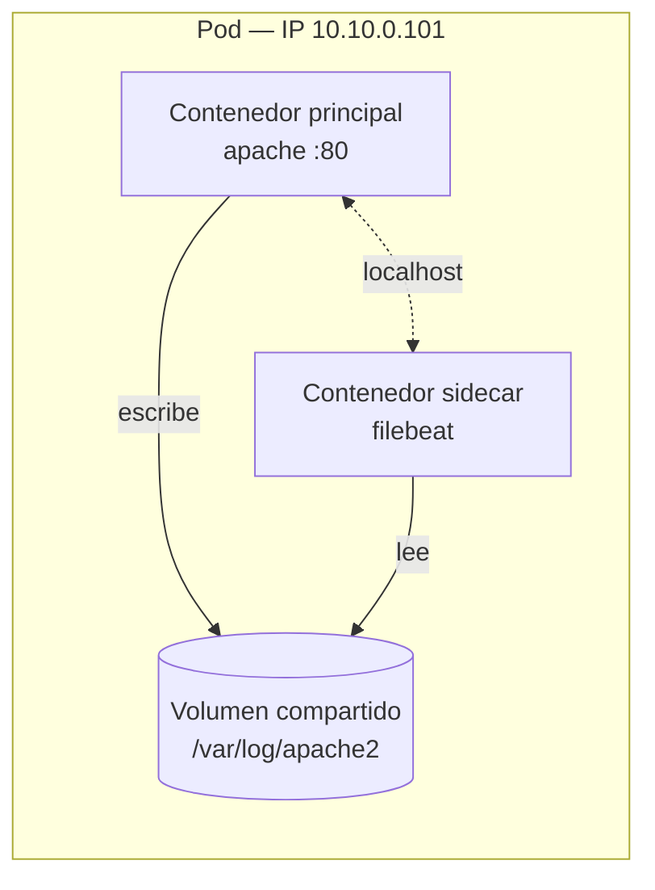
```mermaid
flowchart LR
    subgraph POD["Pod — IP 10.10.0.101"]
        C1["Contenedor principal<br/>apache :80"]
        C2["Contenedor sidecar<br/>filebeat"]
        V[("Volumen compartido<br/>/var/log/apache2")]
        C1 -- "escribe" --> V
        C2 -- "lee" --> V
        C1 <-. "localhost" .-> C2
    end
```

```yaml
kind:         Pod
apiVersion:   v1
metadata:
  name:       ejemplo-pod
spec:
  containers:
    - name:             nginx
      image:            nginx:latest
      imagePullPolicy:  IfNotPresent
```

#### 11.3.2 ¿Cuántos contenedores y cuántos pods?

**Regla 1: un programa por contenedor, siempre.** Cada fabricante publica la
imagen de su programa; juntar varios en un contenedor complica el
mantenimiento, el control de recursos y la actualización independiente.

**Regla 2: programas distintos, pods distintos**, salvo casos muy concretos.
Para decidirlo se revisa cada característica del pod: ¿la **necesito**?, ¿la
**quiero**?

Ejemplo **WordPress (Apache + PHP) y MySQL**:

| Característica del pod            | ¿La necesito? | ¿La quiero?                         |
|-----------------------------------|---------------|-------------------------------------|
| Compartir red / hablar por localhost | No         | Quizá (menos latencia)              |
| Desplegarse en el mismo nodo      | No            | Quizá (menos latencia)              |
| Compartir carpetas locales        | No            | No                                  |
| Actualizarse juntos               | No            | No: quiero actualizar uno sin tocar el otro |
| Escalar juntos                    | No            | **En absoluto**: 1 MySQL y 3 Apache, luego 1 y 5 |

→ **Dos pods.** Además, si escalan por separado, las réplicas de Apache se
quieren en nodos distintos (alta disponibilidad), con lo que `localhost` deja
de tener sentido.

#### 11.3.3 Contenedor sidecar

Ejemplo **Apache y Filebeat** (Filebeat lee el log de Apache y envía cada línea
a Elasticsearch/OpenSearch):

| Característica del pod            | ¿La necesito? | ¿La quiero?                         |
|-----------------------------------|---------------|-------------------------------------|
| Compartir red                     | No            | Indiferente                         |
| Desplegarse en el mismo nodo      | **Sí**        | Sí                                  |
| Compartir carpetas locales        | **Sí**        | Sí                                  |
| Actualizarse juntos               | No            | No                                  |
| Escalar juntos                    | **Sí**        | Sí: cada Apache necesita su Filebeat (relación 1 a 1) |

→ **Un pod.** Apache es el contenedor **principal**; Filebeat es un contenedor
**sidecar**: accesorio, solo tiene sentido porque existe el principal.

Por qué centralizar los logs: un sistema con varias réplicas genera muchos
ficheros de log repartidos por muchas máquinas; consultarlos uno a uno no es
viable, y acumularlos en los discos de los servidores acaba llenándolos. Lo
habitual es configurar en el nodo solo dos ficheros rotados pequeños
(50–100 KB) y, mejor aún, montar la carpeta de logs en memoria (`emptyDir` con
`medium: Memory`, ver [13.2](#132-volúmenes-de-un-pod)).

#### 11.3.4 Nadie escribe pods

En un clúster real **no se crean pods ni se escriben manifiestos de pod**. Si
se quisieran dos réplicas habría que copiar el fichero y cambiarle el nombre.
Lo que se define son **plantillas de pod**, y Kubernetes crea los pods a partir
de ellas ([11.5](#115-plantillas-de-pod-deployment-statefulset-daemonset)).

#### 11.3.5 Imagen y política de descarga

`imagePullPolicy` indica cuándo descarga el nodo la imagen:

| Valor          | Comportamiento                                                     | Cuándo usarlo                    |
|----------------|--------------------------------------------------------------------|----------------------------------|
| `Always`       | La comprueba en el registro cada vez que arranca un contenedor     | Tags flotantes (`2.4`), para coger la última imagen del tag |
| `IfNotPresent` | Solo si no está ya en el nodo                                      | Tags fijos (`2.4.42`)            |
| `Never`        | Nunca; la imagen debe estar ya en el nodo                          | Casos muy especiales             |

Si no se indica, el valor por defecto es `Always` cuando el tag es `latest` o
se omite, e `IfNotPresent` en otro caso. Hay que tener en cuenta que los
registros públicos (Docker Hub) limitan el número de descargas para usuarios
anónimos o gratuitos, y un clúster con muchos despliegues puede agotar ese
límite rápidamente.

#### 11.3.6 Variables de entorno

Se configuran en `env`, con valor fijo o tomado de un ConfigMap o Secret
([11.6](#116-configmap-y-secret)):

```yaml
      env:
        - name:   CHARSET
          value:  UTF-8                       # valor fijo
        - name:   MYSQL_DATABASE
          valueFrom:
            configMapKeyRef:
              name:   ejemplo-configmap
              key:    nombre-bbdd
        - name:   MYSQL_ROOT_PASSWORD
          valueFrom:
            secretKeyRef:
              name:   ejemplo-secret
              key:    contraseña-root
```

### 11.4 Recursos de CPU y memoria

```yaml
      resources:
        requests:
          memory:   128Mi
          cpu:      250m
        limits:
          memory:   128Mi
          cpu:      "1"
```

#### Unidades

| Unidad | Significado                                                                 |
|--------|-----------------------------------------------------------------------------|
| `Mi`, `Gi` | Mebibytes, gibibytes: potencias de 1024 (1 Mi = 1024 Ki). Son los «megas de toda la vida». |
| `M`, `G`   | Megabytes, gigabytes: potencias de 1000 (sistema internacional).        |
| `"1"`      | Un core: tiempo de CPU equivalente a un core completo (puede ser un core al 100 % o cuatro al 25 %). |
| `250m`     | 250 milicores = 0,25 cores.                                             |

#### Requests y limits

- **`requests`** es lo que se **garantiza** al contenedor. El **scheduler** lo
  usa para elegir nodo: solo coloca el pod donde la suma de *requests*
  comprometidos deje hueco, independientemente del uso real.
- **`limits`** es el máximo que se le permite usar si hay recursos libres en el
  nodo.

Superar el límite tiene consecuencias distintas según el recurso:

| Recurso | Al superar el límite                                                                 |
|---------|--------------------------------------------------------------------------------------|
| CPU     | El kernel **retiene** sus peticiones a la CPU: el proceso va más lento, pero sigue vivo |
| Memoria | No se puede quitar memoria ya asignada: el contenedor es **eliminado** (`OOMKilled`) y reiniciado |

Además, si un nodo se queda sin memoria, Kubernetes **desaloja** (*evicts*)
pods para liberarla, empezando por los que consumen por encima de lo que
pidieron. Por eso:

> **Regla general: `limits.memory` = `requests.memory`** en todo servicio que
> atienda a clientes. Si en algún momento va a necesitar esa memoria, que la
> pida desde el principio. (Es la misma recomendación que en Java con
> `-Xms` = `-Xmx`.)

```yaml
# Servicio que atiende a clientes
resources:
  requests: { memory: 512Mi, cpu: "2" }
  limits:   { memory: 512Mi, cpu: "4" }     # la CPU sí puede crecer si hay hueco
```

La excepción son los **programas internos de infraestructura** que están
siempre arrancados pero trabajan de forma esporádica (gestores de
certificados, de volúmenes…). En un clúster hay decenas o cientos; reservarles
memoria fija bloquearía nodos enteros. Se les da un *request* bajo y un
*limit* alto y se agrupan en nodos de infraestructura: si alguno se reinicia
por falta de memoria, no afecta al servicio, solo retrasa su tarea.

```yaml
# Programa de infraestructura de uso esporádico
resources:
  requests: { memory: 64Mi,   cpu: 10m }
  limits:   { memory: 1024Mi, cpu: "2" }
```

### 11.5 Plantillas de pod: Deployment, StatefulSet, DaemonSet

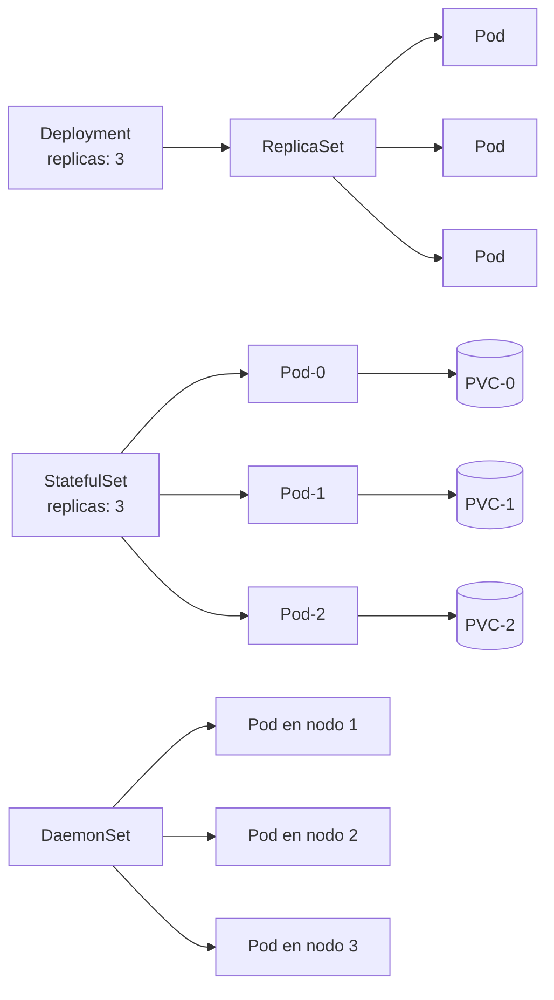
```mermaid
flowchart LR
    D["Deployment<br/>replicas: 3"] --> RS["ReplicaSet"]
    RS --> P1["Pod"]
    RS --> P2["Pod"]
    RS --> P3["Pod"]
    STS["StatefulSet<br/>replicas: 3"] --> S0["Pod-0"] --> V0[("PVC-0")]
    STS --> S1["Pod-1"] --> V1[("PVC-1")]
    STS --> S2["Pod-2"] --> V2[("PVC-2")]
    DS["DaemonSet"] --> N1["Pod en nodo 1"]
    DS --> N2["Pod en nodo 2"]
    DS --> N3["Pod en nodo 3"]
```

| Recurso         | Qué define                                                                 | Uso                                                        |
|-----------------|----------------------------------------------------------------------------|------------------------------------------------------------|
| **Deployment**  | Plantilla de pod + número de réplicas. Pods intercambiables entre sí.      | Aplicaciones sin estado propio: servidores web, Tomcat, APIs |
| **StatefulSet** | Plantilla de pod + número de réplicas + **identidad estable y un volumen propio por réplica** | Programas con estado: bases de datos, colas de mensajes |
| **DaemonSet**   | Plantilla de pod; una réplica **por cada nodo**                            | Infraestructura: monitorización, recogida de logs          |

La elección entre Deployment y StatefulSet **no es libre**: la determina el
tipo de programa. La diferencia está en el almacenamiento y se detalla en
[13.7](#137-statefulset-un-volumen-por-réplica).

```yaml
kind:           Deployment
apiVersion:     apps/v1
metadata:
  name:         ejemplo-despliegue
spec:
  replicas:     3
  selector:
    matchLabels:
      app:      servidor-web          # Debe coincidir con las labels de la plantilla
  template:
    metadata:
      labels:
        app:    servidor-web
    spec:
      containers:
        - name:             nginx
          image:            nginx:1.27
          imagePullPolicy:  IfNotPresent
```

- **`template`** es una plantilla de pod: lleva su propio `metadata` y `spec`.
- **`labels`**: en Kubernetes se etiqueta todo con pares clave–valor libres. La
  clave `app` no es obligatoria, pero es la convención del sector.
- **`selector.matchLabels`** debe coincidir con las *labels* de la plantilla.
  Es un vestigio de cuando la plantilla se definía en un documento aparte y se
  referenciaba por etiquetas.
- El número de réplicas se cambia con:
  `kubectl scale deployment ejemplo-despliegue --replicas=5`.

### 11.6 ConfigMap y Secret

Conjuntos de datos **clave–valor**. No llevan `spec`, sino `data`. Sirven para:

- **Separar perfiles:** desarrollo escribe el manifiesto del despliegue;
  operaciones escribe el ConfigMap/Secret con los datos de cada entorno. Ni
  desarrollo conoce las contraseñas de producción, ni operaciones toca un
  fichero complejo para cambiar tres datos.
- **Independizar entornos:** el mismo manifiesto de despliegue en
  `app1-desarrollo` y `app1-produccion`, cada uno con su ConfigMap.

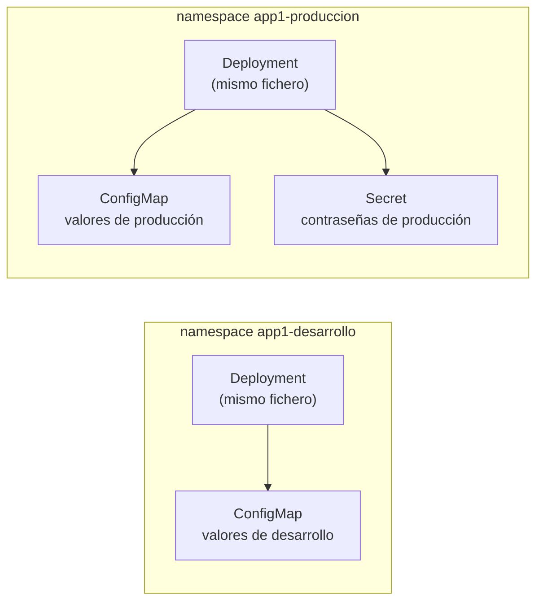
```mermaid
flowchart LR
    subgraph DES["namespace app1-desarrollo"]
        D1["Deployment<br/>(mismo fichero)"] --> C1["ConfigMap<br/>valores de desarrollo"]
    end
    subgraph PRO["namespace app1-produccion"]
        D2["Deployment<br/>(mismo fichero)"] --> C2["ConfigMap<br/>valores de producción"]
        D2 --> S2["Secret<br/>contraseñas de producción"]
    end
```

```yaml
kind:         ConfigMap
apiVersion:   v1
metadata:
  name:       ejemplo-configmap
data:
  nombre-bbdd:    mibbdd
  usuario-bbdd:   miusuario
```

**Secret** tiene la misma estructura, pero los valores van en **base64**:

```yaml
kind:         Secret
apiVersion:   v1
metadata:
  name:       ejemplo-secret
data:
  contraseña-root:      TWlzdXBlcnBhc3N3b3Jk
```

Base64 es una **codificación, no un cifrado**: no aporta seguridad. Lo que
diferencia a un Secret es el tratamiento que recibe dentro del clúster
(permisos de acceso específicos y, si el clúster lo tiene configurado, cifrado
en `etcd`). Por eso **los ficheros de Secret no se escriben ni se guardan en
Git**: se crean desde el cliente, habitualmente por un pipeline que toma los
valores de una bóveda (*vault*):

```bash
kubectl create secret generic ejemplo-secret \
    --from-literal=contraseña-root=Misuperpassword \
    --from-literal=contraseña-usuario=mipassword2
```

ConfigMaps y Secrets pueden consumirse como **variables de entorno**
([11.3.6](#1136-variables-de-entorno)) o como **ficheros montados en un
volumen** ([13.2](#132-volúmenes-de-un-pod)).

---

## 12. Comunicaciones en el clúster

### 12.1 Red del clúster

Los nodos están conectados a la red de la empresa y, además, a una **red
*overlay*** propia del clúster (por ejemplo `10.10.0.0/24`), a la que se
conectan también los pods. Cada pod tiene su IP en esa red.

El problema: los pods se crean y destruyen continuamente, y su IP cambia cada
vez. Si WordPress tiene configurada la IP de la base de datos, deja de
funcionar en cuanto el pod de la base de datos se recrea. Hace falta un
**nombre estable** y, si hay varias réplicas, **balanceo**. Eso es un
**Service**.

### 12.2 Service

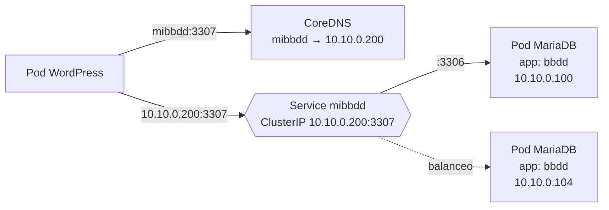
```mermaid
flowchart LR
    WP["Pod WordPress"] -- "mibbdd:3307" --> DNS["CoreDNS<br/>mibbdd → 10.10.0.200"]
    WP -- "10.10.0.200:3307" --> SVC{{"Service mibbdd<br/>ClusterIP 10.10.0.200:3307"}}
    SVC -- ":3306" --> P1["Pod MariaDB<br/>app: bbdd<br/>10.10.0.100"]
    SVC -. "balanceo" .-> P2["Pod MariaDB<br/>app: bbdd<br/>10.10.0.104"]
```

Un Service es:

- una **entrada en el DNS** del clúster (su nombre),
- que apunta a una **IP fija de balanceo** generada por Kubernetes,
- con un **puerto** que se reenvía al puerto de **todos los pods** cuyas
  *labels* coincidan con su `selector`, en balanceo.

Ofrece, por tanto, **nombre resoluble** y **alta disponibilidad**.

| Tipo             | Qué añade                                                                                  | Uso                                         |
|------------------|--------------------------------------------------------------------------------------------|---------------------------------------------|
| **ClusterIP** (por defecto) | Nombre DNS + IP de balanceo, accesibles **solo dentro** del clúster            | Servicios internos: bases de datos, APIs internas |
| **NodePort**     | ClusterIP + un puerto (rango 30000–32767) abierto en **todos los nodos** que reenvía al servicio | Exponer al exterior sin balanceador externo |
| **LoadBalancer** | NodePort + Kubernetes configura automáticamente un **balanceador externo** compatible     | Exponer al exterior                         |

```yaml
kind:           Service
apiVersion:     v1
metadata:
  name:         mibbdd          # Nombre que se da de alta en el DNS del clúster
spec:
  type:         ClusterIP       # Valor por defecto
  selector:
    app:        bbdd            # Labels de los pods destino
  ports:
    - port:         3307        # Puerto del servicio
      targetPort:   3306        # Puerto del contenedor
```

```yaml
kind:           Service
apiVersion:     v1
metadata:
  name:         wp
spec:
  type:         NodePort
  selector:
    app:        wordpress
  ports:
    - port:         80
      targetPort:   80
      nodePort:     30080       # Debe estar en el rango 30000-32767
```

El balanceador externo de un servicio LoadBalancer lo proporciona el cloud
(AWS, GCP, Azure) a cambio de su coste. En un clúster propio hay que instalar
uno compatible, como **MetalLB** (que en su modo L2 no balancea realmente: hace
*failover*, enviando todo a un nodo y cambiando a otro si este cae).

En un clúster estándar, la distribución típica es:

| Tipo         | Cuántos               | Para qué                                             |
|--------------|-----------------------|------------------------------------------------------|
| ClusterIP    | Todos menos uno       | Cada aplicación tiene el suyo                        |
| NodePort     | Ninguno               | —                                                    |
| LoadBalancer | Uno                   | El del **Ingress Controller** (proxy reverso)        |

### 12.3 Cómo se implementa: kube-proxy y netfilter

**Netfilter** es el componente del kernel Linux por el que pasa todo paquete de
red; `iptables` es la herramienta que le define reglas. **kube-proxy** corre en
cada nodo y traduce cada Service en reglas de netfilter de ese nodo:

```
10.10.0.200:3307     → 10.10.0.100:3306                   (ClusterIP mibbdd)
10.10.0.201:80       → 10.10.0.101:80 | 10.10.0.102:80    (ClusterIP wp, balanceado)
192.168.0.201:30080  → 10.10.0.202:80                     (NodePort)
```

Por eso cualquier nodo puede atender una petición a cualquier Service,
independientemente de dónde estén los pods.

### 12.4 Proxy y proxy reverso

| Proxy                                                             | Proxy reverso                                                           |
|-------------------------------------------------------------------|-------------------------------------------------------------------------|
| Protege a los **clientes**                                        | Protege a los **servidores**                                            |
| El cliente le delega la petición; el servidor ve la IP del proxy  | Recibe la petición en nombre de los servidores; el cliente ve la IP del proxy reverso |
| Inspecciona respuestas: virus, *phishing*, certificados, filtrado | Rechaza abusos (DDoS, Slowloris), termina HTTPS, hace de caché, enruta por nombre y ruta |

Ninguno de los dos redirige: ambos hacen la petición en nombre de otro y
devuelven la respuesta.

### 12.5 Ingress e Ingress Controller

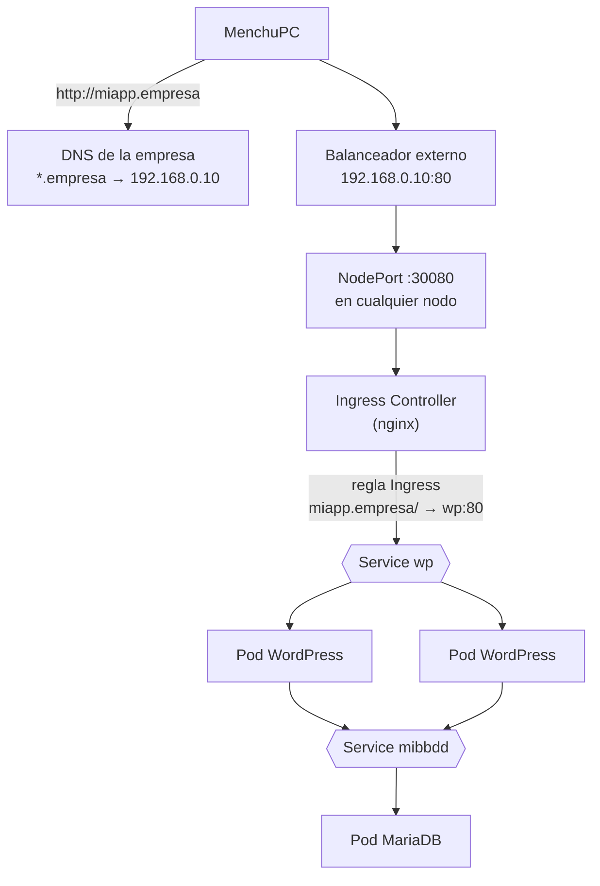
```mermaid
flowchart TB
    U["MenchuPC"] -- "http://miapp.empresa" --> DNSE["DNS de la empresa<br/>*.empresa → 192.168.0.10"]
    U --> LB["Balanceador externo<br/>192.168.0.10:80"]
    LB --> NP["NodePort :30080<br/>en cualquier nodo"]
    NP --> IC["Ingress Controller<br/>(nginx)"]
    IC -- "regla Ingress<br/>miapp.empresa/ → wp:80" --> SVC{{"Service wp"}}
    SVC --> P1["Pod WordPress"]
    SVC --> P2["Pod WordPress"]
    P1 --> DB{{"Service mibbdd"}}
    P2 --> DB
    DB --> M["Pod MariaDB"]
```

Un **Ingress** es una **regla para un proxy reverso**, escrita en una sintaxis
independiente del proxy concreto:

```yaml
kind:           Ingress
apiVersion:     networking.k8s.io/v1
metadata:
  name:         miapp-regla
spec:
  rules:
    - host:         miapp.empresa
      http:
        paths:
          - path:       /
            pathType:   Prefix
            backend:
              service:
                name:   wp
                port:
                  number: 80
```

Un **Ingress Controller**, que instala la administración del clúster, es:

- un **proxy reverso** (nginx, HAProxy, Envoy…), y
- un programa que **traduce las reglas Ingress** a la configuración de ese
  proxy.

La regla anterior se convertiría, en nginx, en:

```nginx
server {
    listen       80;
    server_name  miapp.empresa;
    location / {
        proxy_pass http://wp:80;
    }
}
```

El equipo de desarrollo escribe Ingress sin saber qué proxy hay detrás, y la
administración puede cambiarlo sin que desarrollo se entere. En OpenShift, el
equivalente propio es el recurso **Route**.

---

## 13. Almacenamiento en Kubernetes

### 13.1 Por qué no basta con lo de Docker

En Kubernetes los pods se recrean continuamente y **en cualquier nodo**. Un
volumen en el disco de un nodo no sirve: el pod nuevo puede arrancar en otro.
En producción los datos viven en **cabinas de almacenamiento** accesibles por
red (NFS, iSCSI, Fibre Channel, Ceph) o en el almacenamiento del cloud, y
Kubernetes se encarga de **conectar el volumen al nodo** donde arranca el pod.

Además, el almacenamiento sigue el modelo de autoservicio
([8.4](#84-modelo-de-autoservicio)): desarrollo **pide** cuánto espacio y de
qué tipo; administración **decide** en qué cabina y con qué condiciones.

### 13.2 Volúmenes de un pod

Los volúmenes se declaran a nivel de **pod** (`spec.volumes`) y cada
contenedor decide **dónde montarlos** (`volumeMounts`). Un mismo volumen puede
montarse en varios contenedores del pod: así comparten carpetas.

```yaml
spec:
  volumes:                              # Volúmenes del pod
    - name:         logs
      emptyDir:
        medium:     Memory              # En RAM (equivale a tmpfs)
        sizeLimit:  200Mi
  containers:
    - name:         apache
      image:        httpd:2.4
      volumeMounts:
        - name:         logs            # Referencia al volumen por su nombre
          mountPath:    /usr/local/apache2/logs
    - name:         filebeat            # Sidecar: lee los mismos ficheros
      image:        docker.elastic.co/beats/filebeat:8.15.0
      volumeMounts:
        - name:         logs
          mountPath:    /logs
          readOnly:     true
```

Tipos de volumen más usados:

| Tipo                      | Contenido                                                     | Vida                     | Uso típico                                    |
|---------------------------|---------------------------------------------------------------|--------------------------|-----------------------------------------------|
| `emptyDir`                | Carpeta vacía en el nodo (o en RAM con `medium: Memory`)      | La del **pod**           | Compartir ficheros entre contenedores del pod; temporales |
| `configMap`               | Cada clave del ConfigMap como un fichero                      | La del ConfigMap         | Ficheros de configuración (`nginx.conf`, `application.properties`) |
| `secret`                  | Cada clave del Secret como un fichero                         | La del Secret            | Certificados, claves                           |
| `persistentVolumeClaim`   | Un volumen persistente solicitado al clúster                  | **Independiente** del pod | Datos de aplicación                           |
| `hostPath`                | Una carpeta del nodo                                          | La del nodo              | Solo infraestructura (agentes de monitorización); **no** para aplicaciones |

Equivalencias con Docker:

| Docker                        | Kubernetes                                    |
|-------------------------------|-----------------------------------------------|
| `--tmpfs`                     | `emptyDir` con `medium: Memory`               |
| bind mount de configuración   | volumen `configMap` o `secret`                |
| bind mount de una carpeta del anfitrión | `hostPath` (desaconsejado)          |
| volumen con nombre            | `persistentVolumeClaim`                       |

#### Configuración como fichero

```yaml
kind:         ConfigMap
apiVersion:   v1
metadata:
  name:       nginx-config
data:
  default.conf: |
    server {
        listen 80;
        location / { root /usr/share/nginx/html; }
    }
---
# Dentro de la plantilla de pod:
    spec:
      volumes:
        - name:         config
          configMap:
            name:       nginx-config
      containers:
        - name:         nginx
          image:        nginx:1.27
          volumeMounts:
            - name:         config
              mountPath:    /etc/nginx/conf.d     # Aparece /etc/nginx/conf.d/default.conf
              readOnly:     true
```

### 13.3 PersistentVolume, PersistentVolumeClaim y StorageClass

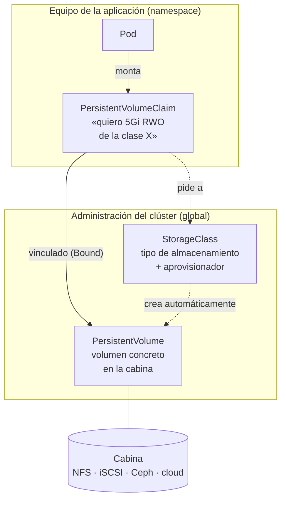
```mermaid
flowchart TB
    subgraph DEV["Equipo de la aplicación (namespace)"]
        POD["Pod"] -- "monta" --> PVC["PersistentVolumeClaim<br/>«quiero 5Gi RWO<br/>de la clase X»"]
    end
    subgraph ADM["Administración del clúster (global)"]
        SC["StorageClass<br/>tipo de almacenamiento<br/>+ aprovisionador"]
        PV["PersistentVolume<br/>volumen concreto<br/>en la cabina"]
    end
    CAB[("Cabina<br/>NFS · iSCSI · Ceph · cloud")]
    PVC -- "vinculado (Bound)" --> PV
    PVC -. "pide a" .-> SC
    SC -. "crea automáticamente" .-> PV
    PV --- CAB
```

| Recurso                         | Ámbito        | Quién lo define        | Qué representa                                              |
|---------------------------------|---------------|------------------------|-------------------------------------------------------------|
| **PersistentVolume (PV)**       | Clúster       | Administración (o un aprovisionador automático) | Un volumen **concreto** que existe en una cabina |
| **PersistentVolumeClaim (PVC)** | Namespace     | Equipo de la aplicación | Una **petición** de almacenamiento: tamaño, modo de acceso, clase |
| **StorageClass**                | Clúster       | Administración          | Un **tipo** de almacenamiento y el programa que crea sus volúmenes |

El PVC es lo único que escribe el equipo de la aplicación. Kubernetes lo
**vincula** (*bind*) a un PV que cumpla lo pedido; a partir de ahí, el PV queda
reservado para ese PVC.

### 13.4 Aprovisionamiento estático y dinámico

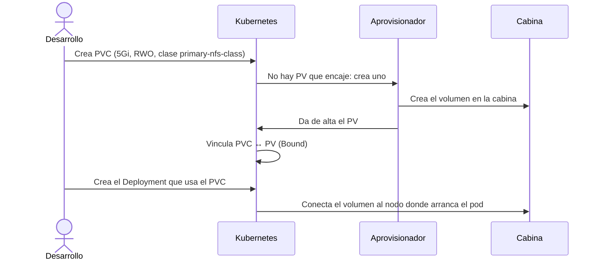
```mermaid
sequenceDiagram
    actor D as Desarrollo
    participant K as Kubernetes
    participant A as Aprovisionador
    participant C as Cabina
    D->>K: Crea PVC (5Gi, RWO, clase primary-nfs-class)
    K->>A: No hay PV que encaje: crea uno
    A->>C: Crea el volumen en la cabina
    A->>K: Da de alta el PV
    K->>K: Vincula PVC ↔ PV (Bound)
    D->>K: Crea el Deployment que usa el PVC
    K->>C: Conecta el volumen al nodo donde arranca el pod
```

- **Estático:** la administración crea los PV a mano, de antemano; los PVC se
  vinculan a alguno de los existentes. Laborioso: hay que adivinar qué
  volúmenes se van a pedir.
- **Dinámico (lo habitual):** el PVC indica una **StorageClass**, y el
  aprovisionador asociado crea el volumen en la cabina y su PV en el momento.
  Si el PVC no indica clase, se usa la marcada **por defecto**.

En el clúster del curso hay una StorageClass por defecto:

```
$ kubectl get storageclass
NAME                          RECLAIMPOLICY   VOLUMEBINDINGMODE   ALLOWVOLUMEEXPANSION
primary-nfs-class (default)   Delete          Immediate           true
```

Es decir: volúmenes **NFS** creados automáticamente, que **se borran** al
borrar el PVC y que pueden **ampliarse**. Los alumnos pueden crear PVC en su
namespace, pero no PV ni StorageClass, que son recursos de todo el clúster.

### 13.5 Propiedades de un volumen persistente

#### Modos de acceso (`accessModes`)

| Modo                    | Abreviatura | Significado                                                  |
|-------------------------|-------------|--------------------------------------------------------------|
| `ReadWriteOnce`         | RWO         | Lectura y escritura desde **un nodo** a la vez               |
| `ReadOnlyMany`          | ROX         | Solo lectura desde **varios nodos**                          |
| `ReadWriteMany`         | RWX         | Lectura y escritura desde **varios nodos** (p. ej. NFS)      |
| `ReadWriteOncePod`      | RWOP        | Lectura y escritura desde **un único pod**                   |

El modo debe estar soportado por el tipo de almacenamiento: un disco iSCSI o
un disco de cloud suele ser solo RWO; NFS admite RWX. Es el caso del ejemplo
de la [sección 8.1](#81-definición): varios Tomcat compartiendo un volumen NFS
(RWX) y un PostgreSQL con su volumen iSCSI exclusivo (RWO).

#### Política de reciclaje (`reclaimPolicy`)

Qué ocurre con el PV y sus datos cuando se borra el PVC:

| Política | Efecto                                                                       |
|----------|------------------------------------------------------------------------------|
| `Delete` | Se borran el PV **y los datos** de la cabina                                 |
| `Retain` | El PV y los datos se conservan; un administrador decide qué hacer con ellos  |

> **Atención:** con `Delete` —la del clúster del curso y la habitual en
> aprovisionamiento dinámico—, **borrar el PVC borra los datos**. Borrar el
> Deployment o el pod no los toca.

#### Ciclo de vida de un PVC

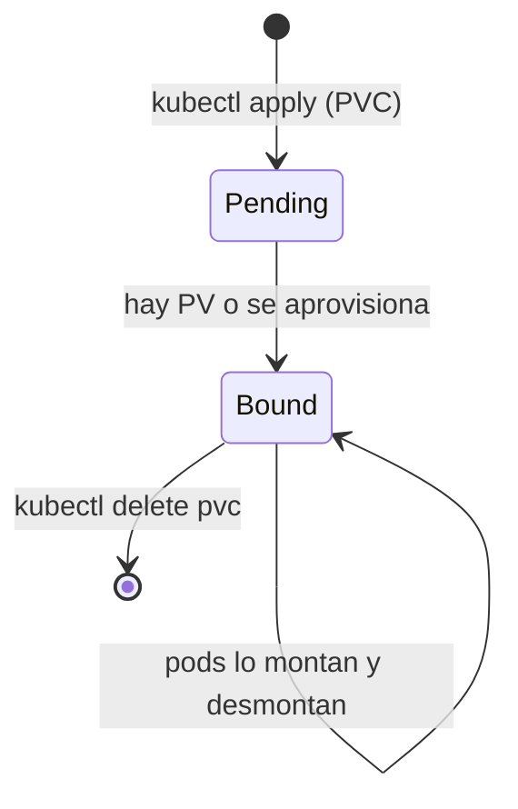
```mermaid
stateDiagram-v2
    [*] --> Pending: kubectl apply (PVC)
    Pending --> Bound: hay PV o se aprovisiona
    Bound --> Bound: pods lo montan y desmontan
    Bound --> [*]: kubectl delete pvc
```

Un PVC que se queda en `Pending` indica que no hay PV que encaje ni
StorageClass capaz de crearlo; `kubectl describe pvc <nombre>` muestra el
motivo.

### 13.6 Ejemplo: MariaDB con un PVC

```yaml
kind:           PersistentVolumeClaim
apiVersion:     v1
metadata:
  name:         datos-mariadb
spec:
  accessModes:
    - ReadWriteOnce
  resources:
    requests:
      storage:  1Gi
  # storageClassName: primary-nfs-class    # Opcional: si se omite, se usa la clase por defecto
---
kind:           Deployment
apiVersion:     apps/v1
metadata:
  name:         mariadb
spec:
  replicas:     1                           # Una sola réplica: el volumen es de una instancia
  strategy:
    type:       Recreate                    # Para la réplica vieja antes de arrancar la nueva
  selector:
    matchLabels:
      app:      bbdd
  template:
    metadata:
      labels:
        app:    bbdd
    spec:
      volumes:
        - name:     datos
          persistentVolumeClaim:
            claimName:  datos-mariadb
      containers:
        - name:     mariadb
          image:    mariadb:11.4
          env:
            - name: MARIADB_ROOT_PASSWORD
              valueFrom:
                secretKeyRef:
                  name: ejemplo-secret
                  key:  contraseña-root
          volumeMounts:
            - name:         datos
              mountPath:    /var/lib/mysql
          resources:
            requests: { memory: 512Mi, cpu: 250m }
            limits:   { memory: 512Mi, cpu: "1" }
```

Comprobación de que los datos sobreviven al pod:

```bash
kubectl apply -f mariadb.yaml
kubectl get pvc                        # STATUS Bound
kubectl delete pod -l app=bbdd         # Kubernetes crea otro pod...
kubectl get pods                       # ...que monta el mismo volumen con los mismos datos
```

`strategy: Recreate` evita que, durante una actualización, convivan dos pods
de MariaDB escribiendo en los mismos ficheros. Aun así, un Deployment no es el
recurso adecuado para escalar una base de datos: para eso está el StatefulSet.

### 13.7 StatefulSet: un volumen por réplica

Si a un Deployment con un PVC se le suben las réplicas, **todas montan el
mismo volumen**. Para un servidor web que sirve los mismos ficheros puede valer
(con RWX); para una base de datos es una corrupción segura. En un clúster de
bases de datos (MariaDB Galera, PostgreSQL con réplicas, Kafka) **cada réplica
necesita su propio volumen** y una identidad estable, porque cada una tiene su
papel y sus datos.

Esto es lo que aporta el **StatefulSet** sobre el Deployment:

| Deployment                                       | StatefulSet                                               |
|--------------------------------------------------|-----------------------------------------------------------|
| Pods con nombre aleatorio (`web-7c9f-x2kq`)      | Pods con nombre fijo y ordinal (`mariadb-0`, `mariadb-1`) |
| Todas las réplicas comparten el PVC de la plantilla | Cada réplica tiene **su propio PVC**, creado a partir de una plantilla (`volumeClaimTemplates`) |
| Al recrear un pod, es un pod nuevo cualquiera    | Al recrear `mariadb-1`, vuelve con el mismo nombre y **el mismo volumen** |
| Arranque y parada en paralelo                    | Arranque en orden (0, 1, 2…) y parada en orden inverso    |
| Nombre de red solo a través del Service          | Cada pod tiene nombre DNS propio a través de un *headless Service* (`mariadb-0.mariadb`) |

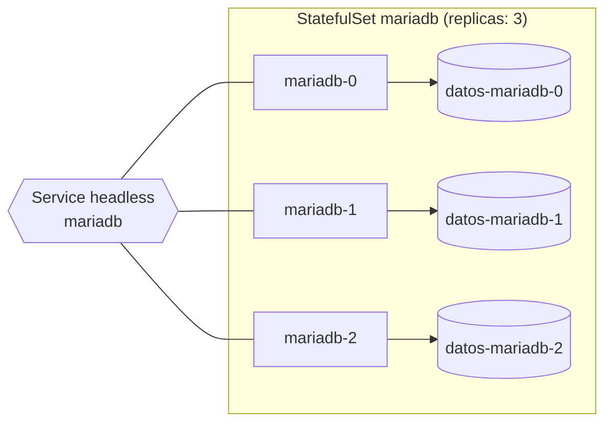
```mermaid
flowchart LR
    HS{{"Service headless<br/>mariadb"}}
    subgraph STS["StatefulSet mariadb (replicas: 3)"]
        P0["mariadb-0"] --> V0[("datos-mariadb-0")]
        P1["mariadb-1"] --> V1[("datos-mariadb-1")]
        P2["mariadb-2"] --> V2[("datos-mariadb-2")]
    end
    HS --- P0
    HS --- P1
    HS --- P2
```

```yaml
kind:           Service
apiVersion:     v1
metadata:
  name:         mariadb
spec:
  clusterIP:    None            # Headless: sin IP de balanceo; da un nombre DNS a cada pod
  selector:
    app:        mariadb
  ports:
    - port:     3306
---
kind:           StatefulSet
apiVersion:     apps/v1
metadata:
  name:         mariadb
spec:
  serviceName:  mariadb         # Service headless que da nombre a los pods
  replicas:     3
  selector:
    matchLabels:
      app:      mariadb
  template:
    metadata:
      labels:
        app:    mariadb
    spec:
      containers:
        - name:     mariadb
          image:    mariadb:11.4
          env:
            - name: MARIADB_ROOT_PASSWORD
              valueFrom:
                secretKeyRef:
                  name: ejemplo-secret
                  key:  contraseña-root
          volumeMounts:
            - name:         datos            # Nombre de la plantilla de PVC
              mountPath:    /var/lib/mysql
          resources:                         # 3 réplicas: caben en la cuota de 1Gi de petición
            requests: { memory: 300Mi, cpu: 100m }
            limits:   { memory: 300Mi, cpu: 500m }
  volumeClaimTemplates:         # Plantilla de PVC: se crea uno por réplica
    - metadata:
        name:       datos
      spec:
        accessModes:
          - ReadWriteOnce
        resources:
          requests:
            storage: 1Gi
```

Los PVC creados se llaman `<plantilla>-<statefulset>-<ordinal>`:
`datos-mariadb-0`, `datos-mariadb-1`, `datos-mariadb-2`.

> **Atención:** al borrar o reducir un StatefulSet, sus PVC **no se borran**,
> precisamente para no perder datos. Si se vuelve a crear el StatefulSet, cada
> réplica recupera su volumen. Para liberar el espacio hay que borrarlos
> explícitamente: `kubectl delete pvc datos-mariadb-0 datos-mariadb-1 datos-mariadb-2`.

Este manifiesto muestra solo el almacenamiento: configurar de verdad un clúster
Galera requiere además la configuración propia de MariaDB, que normalmente
aporta un operador o un chart.

### 13.8 Resumen: qué volumen usar

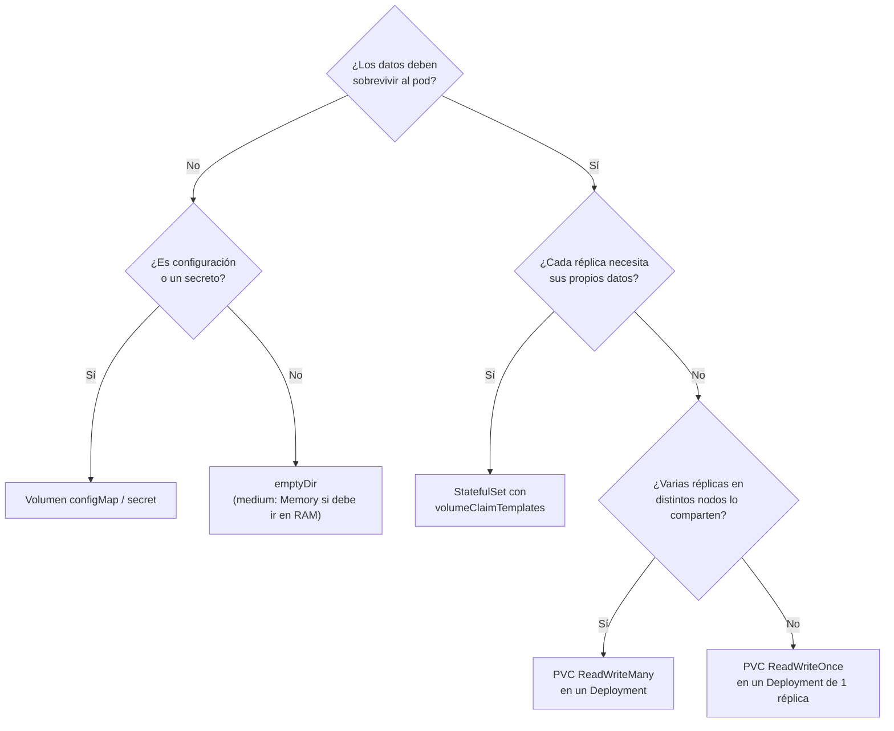
```mermaid
flowchart TD
    Q1{"¿Los datos deben<br/>sobrevivir al pod?"}
    Q1 -- No --> Q2{"¿Es configuración<br/>o un secreto?"}
    Q2 -- Sí --> CM["Volumen configMap / secret"]
    Q2 -- No --> ED["emptyDir<br/>(medium: Memory si debe ir en RAM)"]
    Q1 -- Sí --> Q3{"¿Cada réplica necesita<br/>sus propios datos?"}
    Q3 -- Sí --> STS["StatefulSet con<br/>volumeClaimTemplates"]
    Q3 -- No --> Q4{"¿Varias réplicas en<br/>distintos nodos lo comparten?"}
    Q4 -- Sí --> RWX["PVC ReadWriteMany<br/>en un Deployment"]
    Q4 -- No --> RWO["PVC ReadWriteOnce<br/>en un Deployment de 1 réplica"]
```

---

## 14. Operación del clúster: probes

Kubernetes vigila continuamente los pods. La primera comprobación la hace el
gestor de contenedores: si el **proceso principal** del contenedor termina,
Kubernetes lo reinicia. Pero que el proceso esté vivo no significa que el
programa funcione. Para eso se definen **probes**: pruebas periódicas que
pueden ser un comando (correcto si devuelve código 0), una petición HTTP
(correcto si responde 2xx/3xx) o una conexión TCP.

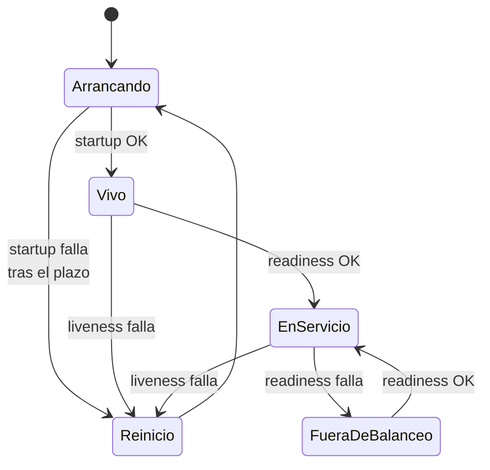
```mermaid
stateDiagram-v2
    [*] --> Arrancando
    Arrancando --> Vivo: startup OK
    Arrancando --> Reinicio: startup falla<br/>tras el plazo
    Vivo --> Reinicio: liveness falla
    Vivo --> EnServicio: readiness OK
    EnServicio --> FueraDeBalanceo: readiness falla
    FueraDeBalanceo --> EnServicio: readiness OK
    EnServicio --> Reinicio: liveness falla
    Reinicio --> Arrancando
```

| Probe         | Pregunta                          | Si falla                                          | Ejemplo (MariaDB)                              |
|---------------|-----------------------------------|---------------------------------------------------|------------------------------------------------|
| **startup**   | ¿Ha terminado de arrancar?        | Pasado el plazo, se **reinicia** el contenedor    | Admite hasta 5 minutos: puede estar migrando datos |
| **liveness**  | ¿Sigue vivo?                      | Se **reinicia** el contenedor                     | `mysqladmin ping`; tolerante, por si está haciendo una copia larga |
| **readiness** | ¿Puede atender tráfico ahora?     | Se **saca del balanceo** del Service, sin reiniciar | `SELECT 1`                                   |

Las pruebas de *liveness* y *readiness* empiezan cuando la de *startup* ha
dado bien.

```yaml
      containers:
        - name:     mariadb
          image:    mariadb:11.4
          startupProbe:
            exec:
              command: ["healthcheck.sh", "--connect"]
            periodSeconds:      10
            failureThreshold:   30          # 30 × 10 s = 5 minutos para arrancar
          livenessProbe:
            exec:
              command: ["healthcheck.sh", "--connect"]
            periodSeconds:      30
            failureThreshold:   3
          readinessProbe:
            exec:
              command: ["healthcheck.sh", "--connect", "--innodb_initialized"]
            periodSeconds:      10
```

---

## 15. El cliente `kubectl`

### 15.1 Configuración

`kubectl` es un único ejecutable. Lee la conexión del fichero
`~/.kube/config` (en Windows, `C:\Users\<usuario>\.kube\config`), que contiene
la URL del clúster, el usuario, su credencial (token) y el certificado de la
CA que firma el HTTPS del clúster. Ver
[acceso-al-cluster.md](acceso-al-cluster.md).

### 15.2 Sintaxis

```
kubectl <VERBO> <TIPO_RECURSO> [<nombre>] [opciones]
```

| Tipo de recurso          | Alias  |
|--------------------------|--------|
| `namespace`              | `ns`   |
| `pod`                    | `po`   |
| `deployment`             | `deploy` |
| `statefulset`            | `sts`  |
| `service`                | `svc`  |
| `configmap`              | `cm`   |
| `secret`                 | —      |
| `ingress`                | `ing`  |
| `persistentvolumeclaim`  | `pvc`  |
| `persistentvolume`       | `pv`   |
| `storageclass`           | `sc`   |

| Verbo                         | Descripción                                          |
|-------------------------------|------------------------------------------------------|
| `get`                         | Lista recursos                                       |
| `describe <nombre>`           | Muestra un recurso en detalle, con sus eventos       |
| `delete <nombre>`             | Elimina un recurso                                   |
| `logs <pod> [-c contenedor]`  | Muestra el log de un contenedor                      |
| `exec -it <pod> -- <comando>` | Ejecuta un comando dentro de un contenedor           |
| `scale --replicas=N`          | Cambia el número de réplicas                         |

| Opción                     | Descripción                                        |
|----------------------------|----------------------------------------------------|
| `-n`, `--namespace <ns>`   | Namespace del recurso                              |
| `-o wide`                  | Más columnas en el listado                         |
| `-o yaml`                  | El recurso completo en YAML                        |
| `-l clave=valor`           | Filtra por labels                                  |

### 15.3 Trabajo con manifiestos

| Comando                   | Efecto                                                   |
|---------------------------|----------------------------------------------------------|
| `kubectl create -f f.yaml`| Da de alta los recursos; falla si ya existen             |
| `kubectl apply -f f.yaml` | Los da de alta o los actualiza: **idempotente**          |
| `kubectl delete -f f.yaml`| Borra los recursos definidos en el fichero               |

Existen comandos imperativos para crear recursos sin fichero
(`kubectl create namespace …`, `kubectl run …`), pero **no se usan**: lo que se
teclea en una terminal no queda registrado ni es reproducible, y todo lo que se
crea en un clúster debe estar en Git, versionado. La excepción es justamente lo
que **no** debe quedar registrado: los **Secrets**
([11.6](#116-configmap-y-secret)).

---

## Anexo A: conceptos de apoyo

### A.1 Versionado semántico

```
A.B.C   →   MAJOR.MINOR.PATCH
```

| Parte     | Sube cuando…                                                                 |
|-----------|------------------------------------------------------------------------------|
| **MAJOR** | Hay un cambio incompatible (*breaking change*): se quita o cambia algo       |
| **MINOR** | Se añade funcionalidad, o se marca algo como obsoleto                        |
| **PATCH** | Se corrigen errores                                                          |

El **minor** determina la funcionalidad. Si una aplicación necesita lo que da
MySQL 5.7, lo que interesa es el 5.7 con el patch más alto: el 5.8 trae
funcionalidad que no se usa (y posibles errores nuevos), y el 6.0 puede romper
la aplicación. De ahí la recomendación de tags `A.B`.

### A.2 UNIX, Linux y Windows

- **UNIX** fue un sistema operativo de los Laboratorios Bell (AT&T), licenciado
  a fabricantes y universidades, que dio lugar a cientos de variantes
  incompatibles. Para ordenarlas nacieron los estándares **SUS** y **POSIX**.
  Hoy «UNIX» es la certificación de los sistemas que los cumplen: AIX, HP-UX,
  Solaris, macOS.
- **Linux** no es un sistema operativo, sino un **kernel**: la capa que
  gestiona hardware, memoria, procesos, seguridad y red. Es el kernel más usado
  del mundo. Sobre él corren GNU/Linux (distribuciones de las familias Red Hat
  —RHEL, Fedora, Rocky, Alma—, Debian —Ubuntu, Mint—, Arch o SUSE), Android y,
  mediante WSL, Windows.
- **Windows** es una familia de sistemas operativos, con kernel propio (NT).

Un sistema operativo son miles de programas en capas: el kernel, las
herramientas para interactuar con él (CLI y GUI) y las utilidades.

### A.3 nginx y Apache httpd

**nginx** nació como **proxy reverso** y ganó funciones de servidor web;
**Apache httpd** nació como **servidor web** y ganó funciones de proxy reverso.

---

## Anexo B: manifiestos de ejemplo

| Fichero                                                      | Recurso      | Contenido                                                       |
|--------------------------------------------------------------|--------------|-----------------------------------------------------------------|
| [1-pod-sencillo.yaml](../ejemplos/1-pod-sencillo.yaml)       | Pod          | Pod mínimo con un contenedor nginx                              |
| [1-pod.yaml](../ejemplos/1-pod.yaml)                         | Pod          | Pod con `imagePullPolicy`, recursos y variables de entorno desde ConfigMap y Secret |
| [2-configmap.yaml](../ejemplos/2-configmap.yaml)             | ConfigMap    | Datos de conexión a la base de datos                            |
| [3-secret.yaml](../ejemplos/3-secret.yaml)                   | Secret       | Contraseñas en base64 (solo como ilustración: los Secrets se crean con `kubectl create secret`) |
| [4-deployment.yaml](../ejemplos/4-deployment.yaml)           | Deployment   | Tres réplicas de nginx a partir de una plantilla con `app: servidor-web` |
| [5-service.yaml](../ejemplos/5-service.yaml)                 | Service      | ClusterIP `mi-nginx`, puerto 81 → 80 de los pods `app: servidor-web` |

Los ejemplos de volúmenes (secciones [13.2](#132-volúmenes-de-un-pod),
[13.6](#136-ejemplo-mariadb-con-un-pvc) y
[13.7](#137-statefulset-un-volumen-por-réplica)) están pensados para
probarse en el namespace de cada alumno, que usa la StorageClass por defecto
del clúster del curso. Necesitan el Secret `ejemplo-secret` creado antes, y
conviene probarlos de uno en uno: el Deployment de 13.6 y el StatefulSet de
13.7 juntos superan la cuota de memoria del namespace.
